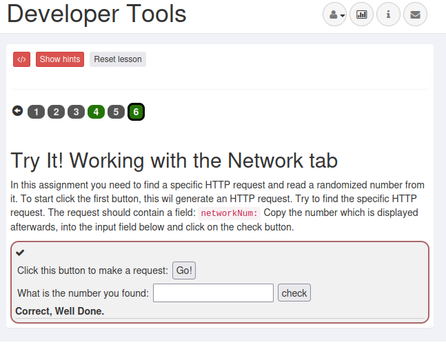
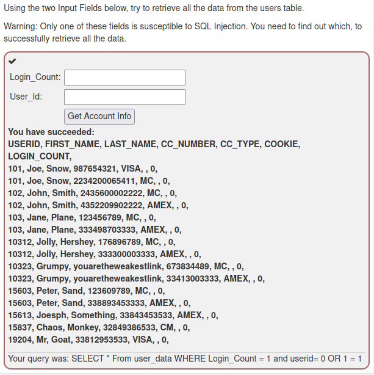

# h2 Totally Legit Sertificate
*Attacking the Web!   
SQL Injections, XSS, CSRF etc.   
WebGoat, Zap Proxy, intercepting requests, manipulating and stuff.   
VulnHub, HackTheBox.*

Host:  
`I used Debian 11, Lenovo Thinkpad E15`
```bash
~$ lsb_release -a
No LSB modules are available.
Distributor ID:	Debian
Description:	Debian GNU/Linux 11 (bullseye)
Release:	11
Codename:	bullseye
```

All these assignments were done with Kali Linux in VirtualBox:     
```bash
──(kali㉿kali)-[~]
└─$ grep VERSION /etc/os-release
VERSION="2023.1"
VERSION_ID="2023.1"
VERSION_CODENAME="kali-rolling"
                                                                                                                    
┌──(kali㉿kali)-[~]
└─$ uname -a
Linux kali 6.1.0-kali5-amd64 #1 SMP PREEMPT_DYNAMIC Debian 6.1.12-1kali2 (2023-02-23) x86_64 GNU/Linux
```
--- 
**[Tero Karvinen himself, in the course lecture](https://terokarvinen.com/2023/tunkeutumistestaus-2023-kevat/) has been used   as a source for these assignments**   
*Other possible sources are mentioned separately in the sections they are used in.*

## x) Lue ja tiivistä. (Tässä x-alakohdassa ei tarvitse tehdä testejä tietokoneella, vain lukeminen tai kuunteleminen ja tiivistelmä riittää. Tiivistämiseen riittää muutama ranskalainen viiva.)

- PortSwigger: [SQL injection](https://portswigger.net/web-security/sql-injection)
	- SQL injection is a web vulnerability where attackers manipulate input to interact with a database, accessing sensitive data or executing unauthorized commands. 
	- This often works due to poor validation and sanitization. 
	- Preventing requires security measures like input validation and avoiding dynamic SQL construction. 

- PortSwigger: [Cross-site scripting](https://portswigger.net/web-security/cross-site-scripting)
	- Cross-Site Scripting (XSS) is a web security vulnerability where attackers inject malicious scripts into web pages, stealing sensitive information or performing unauthorized actions on behalf of victims. 
	- This occurs when web applications fail to properly sanitize user input. 
	- XSS attacks come in different types and exploit different vulnerabilities in input validation and output encoding. 
	- Preventing requires measures like input validation, output encoding, and Content Security Policy. 

---
## a) ZAP! Asenna ZAP välimiesproxy ja näytä, että pystyt sieppaamaan liikennettä selaimesta.

*I installed Zap for demonstration purposes, but as i'm using Kali, it has it preinstalled, and will be using that in these assignments.*

To install Zap, i went to:   
https://www.zaproxy.org/download/   
And took the `Cross Platform Package`   
Extracted the `ZAP_2.12.0_Core.zip` zip to some temp location in `home`   
In that folder, i ran:   
```bash
./zap.sh
```
And it started:

   

*Note: If not mentioned otherwise, i will use the first option, in persistent sessions*

**Proofs of intercepting traffic from browser are shown in the next assignment.**

---
## b) Totally Legit Sertificate. Asenna ZAP:n generoima CA-sertifikaatti selaimeen ja osoita testillä, että pystyt sieppaamaan HTTPS-salakirjoitettua liikennettä.

To get started i fired up my Zap and Firefox, and from there:

Zap:
- First i configured the proxy address and port to Zap:
	- Tools -> Options -> Network -> Local Servers/Proxies -> 
		- Address: localhost | Port: 8888


- Then created the root certificate:
	- Tools -> Options -> Network -> Server Certificates -> Generate -> "Yes" -> Save


Firefox:
- -> Settings -> Search-> "Certificate" ->  View Certificates... -> Authorities -> (Possibly if exist, delete OWASP Root CA) -> Import -> 'Choose generated .cert' -> \[X] Trust this CA to identify websites. -> Ok -> Ok
	- Restart Firefox


**Proofs of intercepted HTTPS traffic:**   


---
## d) Vuohi. [Asenna WebGoat](https://terokarvinen.com/2020/install-webgoat-web-pentest-practice-target/) ja kokeile, että pääset kirjautumaan sisään.

Against the well written instructions by Tero ...   
https://terokarvinen.com/2020/install-webgoat-web-pentest-practice-target/   
... i did it a little bit different, once again, for testing and learning purposes.    

I haven't used Docker a lot, but I've grown a interest to it, during my studies.   

### Running WebGoat 8 in Docker:

**First installed Docker to my Kali machine:**
```bash
$ sudo apt-get install docker.io
```

As i didn't want to run Docker as `sudo` and I've had this problem before some time ago, the link for explaining what to do now:
https://www.digitalocean.com/community/questions/how-to-fix-docker-got-permission-denied-while-trying-to-connect-to-the-docker-daemon-socket

So i added myself to `docker` group, logged out and back in.
And personal note:
[Reload users group without logging out](https://superuser.com/questions/272061/reload-a-linux-users-group-assignments-without-logging-out)

**Next Firefox Proxy add-on to make life easier when using WebGoat at localhost:**
- [FoxyProxy](https://addons.mozilla.org/en-US/firefox/addon/foxyproxy-standard/?utm_source=addons.mozilla.org&utm_medium=referral&utm_content=search)

After installing FoxyProxy, i set up the proxies in it.      
- Options -> +Add -> Title: Zap (for example) -> Proxy Type: HTTP -> Proxy address: 127.0.0.1 | Port 8888 (The one where Zap is currently) 
	- Save

Then to use the proxy for only certain site/address, for WebGoat in this case, which is going to run on port 8080:   
In FoxyProxy Options:   
- Previously created "Zap" -> Patterns -> Pattern: localhost:8080
	- Save

Selected FoxyProxy addon, and checked "Use Enabled Proxies By Patterns and Order", so that it only proxies the one address defined by me. Then i restart Firefox once again just in case.   

**Running the WebGoat:**   
I started the WebGoat with:
```bash
docker --name webgoat run -p 8080:8080 -e TZ=Europe/Helsinki webgoat/webgoat-8.0
```
*[In Webgoat Docker notes](https://hub.docker.com/r/webgoat/webgoat) it was noted that the timezone should be the same as the Host.*

So now, in the future i can just start it and stop it with :    
```bash
docker start webgoat
docker stop webgoat
```

**A quick recap where i was now, at this point in the assignments:**
- WebGoat Docker image running in port 8080
- Firefox, only connection from localhost:8080 is proxied to localhost:8888
- Zap proxy listening to localhost:8888

Double checked that no other sites got proxied, just by surfing to google.com and observing the Zap.


*All was good.*

**Creating user and login in to WebGoat:**   
http://localhost:8080/WebGoat/login   
`Register new user`   

    
 
 `Sign up`   
 
 
**And done**

For the quickstart and stuff, i did shell script to start Zap and WeGoat together:   
```bash     
┌──(kali㉿kali)-[~/webGoat]
└─$ cat startwebGoatLab 
#!/bin/bash
docker start webgoat
zaproxy
```

---
## c) Intercept. Pysäytä hakupyyntö, muokkaa sitä ja päästä se palvelimelle.
As the WebGoat was running in localhost:8080/WebGoat and traffic proxied through Zap, i browsed to the `http://localhost:8080/WebGoat/registration`     
I added a breaking point in Zap to:     

   
So that it stops if someone does something in a url that matches the `String`.   

In registration i put:    
- Username: regularuser    
- Password: easypeasy   

After `Sign up` in WebGoat registration page, i went to Zap and changed the credentials:   


Then removed the breaking point, and released the request with `Submit and continue to next breaking point`.   
After that i saw that it has registered and logged in, with the credentials given from Zap:   


---
## e) Vauvavuohi. Ratkaise WebGoatista tehtävät "HTTP Basics" ja "Developer tools". Katso vinkit alta.
*These are done, without a detailed reporting, as i focused mostly to HTB*

### General:
**HTTP Basics**

**2.& 3. DONE:**   


**Developer tools:**

**4\.**   


6\.   




---
## f) SELECT * FROM student. Ratkaise [SQLZoo:sta](https://sqlzoo.net/wiki/SQL_Tutorial): 
*This i did as a speedrun, and it took about 5 minutes with a cup of coffee.*

### [0 SELECT basics](https://sqlzoo.net/wiki/SELECT_basics)   

1\.
```sql
SELECT population FROM world
  WHERE name = 'Germany';
```


2\.
```sql
SELECT name, population FROM world
  WHERE name IN ('Sweden', 'Norway', 'Denmark');
```


3\.
```sql
SELECT name, area FROM world
  WHERE area BETWEEN 200000 AND 250000;
```


### [2 SELECT from World](https://sqlzoo.net/wiki/SELECT_from_WORLD_Tutorial) kohdat 1-5.

1\.
```sql
SELECT name, continent, population FROM world;
```


2\.
```sql
SELECT name FROM world
WHERE population >= 200000000;
```


3\.
```sql
SELECT name, GDP/population FROM world
WHERE population >= 200000000;
```


4\.
```sql
SELECT name, population/1000000 FROM world 
WHERE continent = 'South America';
```


5\.
```sql
SELECT name, population FROM world 
 WHERE name IN ('France', 'Germany', 'Italy');
```


---
## g) Ratkaise WebGoatista:
*These are done, without a detailed reporting, as i focused mostly to HTB*

### A1 Injection
- **SQL Injection (intro)**

**2\. What is SQL?**    


**3\. Data Manipulation Language (DML)**   


**4\. Data Definition Language (DDL)**      


**5\. Data Control Language (DCL)**    
`GRANT ALL ON grant_rights TO unauthorized_user`    


**9\. Try It! String SQL injection**     


**10\. Try It! Numeric SQL injection**     


**11\. Compromising confidentiality with String SQL injection**  
- Employee Name: Anything  
- Authentication TAN: `' OR '1' = '1`  


**12\. Compromising Integrity with Query chaining**  
```sql
'OR '1' = '1'; UPDATE employees SET SALARY = 100000 WHERE LAST_NAME = 'Smith
```


**13\. Compromising Availability**  
```sql
%'; DROP TABLE access_log;--
```


**SQL Injection (intro), suoritettuna:**  


---
### A2 Broken authentication:
- **Authentication bypasses:**    

**2\. 2FA Password Reset**  


Okey Dokey. This one i think i havent done before...   
But first to test what happens with tests:     


Then to check in Zap:   


Okay, so as it showed in the description and in the Request, the authentication is made with "SEC_QUESTIONS" so i made my own variables.  
In Manual Request Editor:   
```bash
secQuestionWhatever=test_teacher&secQuestionsAnotherOne=test_street&jsEnabled=1&verifyMethod=SEC_QUESTIONS&userId=12309746
```
And Send:   


**BOOOOOM!**

---
### A3 Sensitive data exposure
- **Insecure Login:**

**2\. Let's try**  


So, i did a test submit again.   
In Zap, nothing useful was found... Atleast for me.  
OR! I misread, i needed to click the Log In, not Submit.   
After that i found:


**Muaahahahaaaa!**   
With those credentials:   


---
### A7 Cross Site Scripting (XSS): Cross site scripting

**2\. What is XSS?**  


This one was fun.
So i opened 2 tabs, side by side, had to `allow pasting` in console, and enter the given `alert(document.cookie);`   


Both had the same cookies:     


**7\. Try It! Reflected XSS**  


Hahaaa!
Tested `<script>alert("Credit card highjacked")</script>` in field, and credit card field gave the `alert` popup.  


---
### A8:2013 Request Forgeries:
- **Cross-Site Request Forgeries**

**3\. "Basic Get CSRF Exercise"**   


This one was new for me.   
Submit Query, gave this:   


I had to check the tips...   
So i made myself a copy of the form, a simple local .html file:   
```bash
<html>
<body>
<form id="basic-csrf-get" accept-charset="UNKNOWN" method="POST" name="form1" target="_blank" successcallback="" action="/WebGoat/csrf/basic-get-flag">
<input name="csrf" type="hidden" value="true">
<input type="submit" name="submit">
</body>
</form>
</html>
```

Which when opened in browser, and pressing "submit" lead to:  
`file:///WebGoat/csrf/basic-get-flag` = Not Found   
So i tinkered it to lead to the absolute path, by assigning the `action` to `http://localhost:8080/WebGoat/csrf/basic-get-flag` aaaaaand:   


Now i had the flag and inputted it to where the assignment said and:       


**Profit!**

**4\. "Post a review on someone else’s behalf".**

This one i did pretty straight forward, or at least started the same as the previous.   
Made a copy of the form, and straight editing the "action" to point to the right site:
```html
<html>
<body>
<form class="attack-form" accept-charset="UNKNOWN" id="csrf-review" method="POST" name="review-form" successcallback="" action="http://localhost:8080/WebGoat/csrf/review">
<input class="form-control" id="reviewText" name="reviewText" placeholder="Add a Review" type="text">
<input class="form-control" id="reviewStars" name="stars" type="text">
<input type="hidden" name="validateReq" value="2aa14227b9a13d0bede0388a7fba9aa9">
<input type="submit" name="submit" value="Submit review">
</form>
</body>
</html>
```

Opening this in the browser window:   


And submitting the review:   


Worked!   
And proofs:   


---
## h) Vapaaehtoinen bonus: ratkaise Vulhubista valitsemasi kone.

For this optional assignment, i wanted a [machine that has some sort of vulnerabilities in WordPress](https://www.vulnhub.com/?q=wordpress&sort=date-asc), as those I'm not familiar with at all.   

The report is [Here](VulnHub/colddbox.md)

---
## htb) Hack The Box progress

During these 2 weeks, that was the time limit for these assignments, i managed to pwn my first two machines in [HackTheBox](https://www.hackthebox.com/)   
*As they are active machines, i wont be posting a report about those, but can show them in the lesson, if necessary.*

[My Profile](https://app.hackthebox.com/users/1229016)   
Proofs:   

