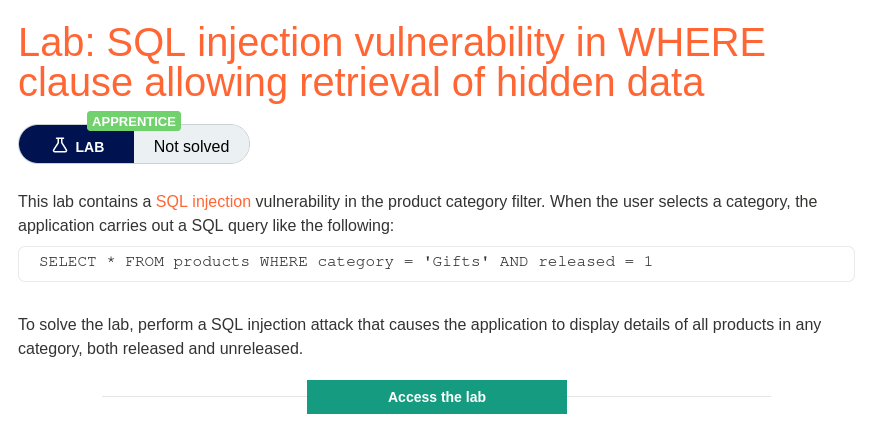
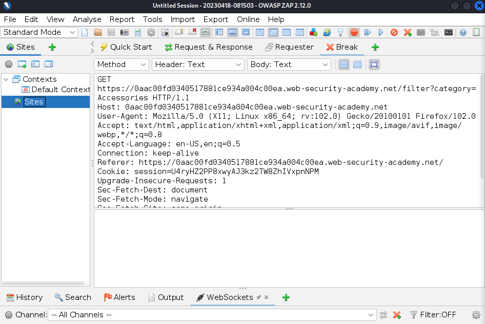
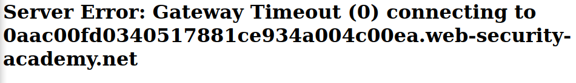
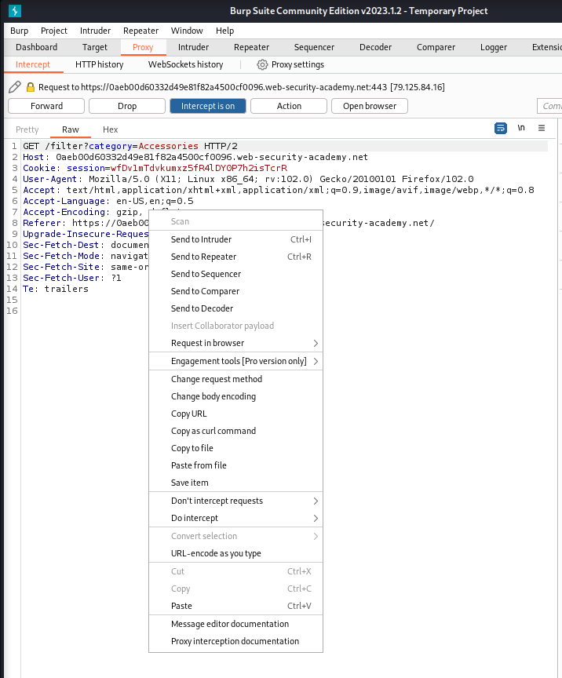
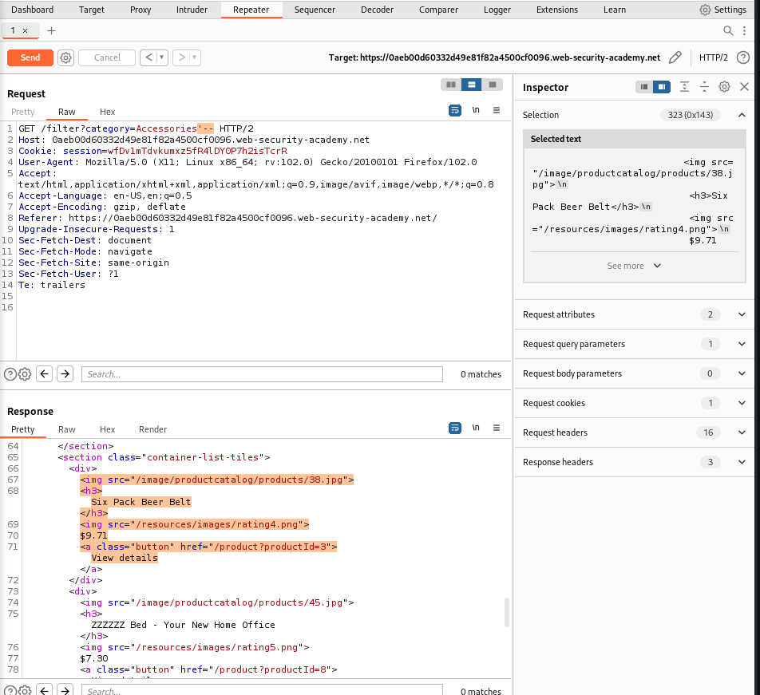
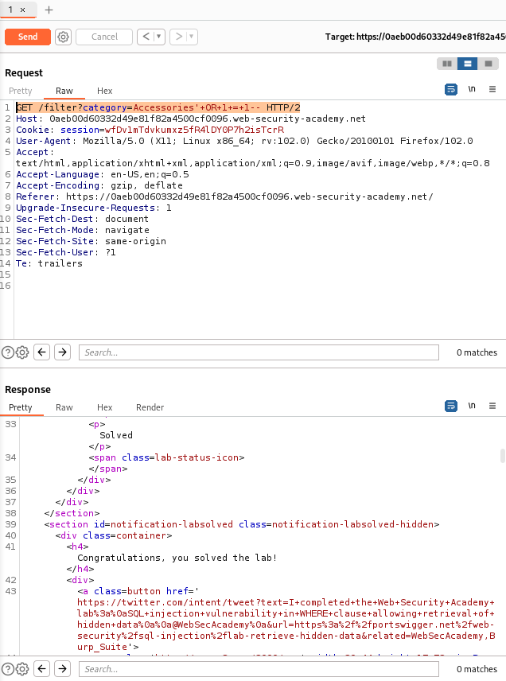
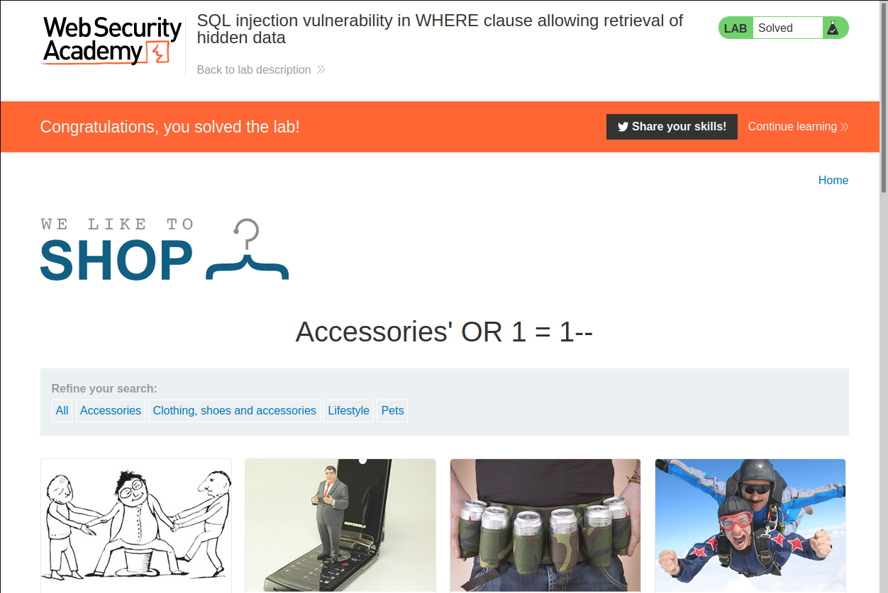
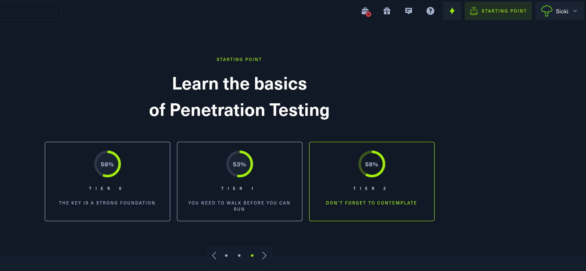

# h3 The Box
*Things get serious!    
Hacking the Boxes!!!*

Host:  
`I used Debian 11, Lenovo Thinkpad E15`
```bash
~$ lsb_release -a
No LSB modules are available.
Distributor ID:	Debian
Description:	Debian GNU/Linux 11 (bullseye)
Release:	11
Codename:	bullseye
```

All these assignments were done with Kali Linux in VirtualBox:     
```bash
──(kali㉿kali)-[~]
└─$ grep VERSION /etc/os-release
VERSION="2023.1"
VERSION_ID="2023.1"
VERSION_CODENAME="kali-rolling"
                                                                                                                    
┌──(kali㉿kali)-[~]
└─$ uname -a
Linux kali 6.1.0-kali5-amd64 #1 SMP PREEMPT_DYNAMIC Debian 6.1.12-1kali2 (2023-02-23) x86_64 GNU/Linux
```
---
**[Tero Karvinen himself, in the course lecture](https://terokarvinen.com/2023/tunkeutumistestaus-2023-kevat/) has been used   as a source for these assignments**   

## x) Katso ja tiivistä (Tässä x-alakohdassa ei tarvitse tehdä testejä tietokoneella, vain lukeminen tai kuunteleminen ja tiivistelmä riittää. Tiivistämiseen riittää muutama ranskalainen viiva.)

-   Yksi valitsemasi [IppSec:n murtautumisvideo](https://www.youtube.com/@ippsec).

**For this assignment i watched:**   
[IppSec: Hack The Box - Encoding](https://www.youtube.com/watch?v=iyGvnmkx1es)

- Discovered a Server-Side Request Forgery ([SSRF](https://portswigger.net/web-security/ssrf)) vulnerability by interacting with an API server. 
- Built a webserver in [Flask](https://flask.palletsprojects.com/en/2.2.x/) as [middleware](https://www.redhat.com/en/topics/middleware/what-is-middleware) to exploit this vulnerability, which allowed him to download files from the server.
- Used [Gobuster](https://github.com/OJ/gobuster) to find a .git repository and exploited a Local File Inclusion ([LFI](https://owasp.org/www-project-web-security-testing-guide/v42/4-Web_Application_Security_Testing/07-Input_Validation_Testing/11.1-Testing_for_Local_File_Inclusion)) vulnerability in the code to get remote code execution ([RCE](https://owasp.org/www-community/attacks/Code_Injection)). 
- As he was able to run `git commit` as sudo, he inserted a POST-COMMIT hook to create a [Reverse Shell](https://pentestmonkey.net/cheat-sheet/shells/reverse-shell-cheat-sheet) and access the machine with SSH.
- He then did the [PrivEsc](https://en.wikipedia.org/wiki/Privilege_escalation) to get access to the root by creating a service in systemd, that added hi's public key, to root user authorized keys, so he could connect to the machine via SSH as root. 

---
## a) We like to shop. Ratkaise Portswigger Academyn ["Lab: SQL injection vulnerability in WHERE clause allowing retrieval of hidden data"](https://portswigger.net/web-security/sql-injection/lab-retrieve-hidden-data). (Tee tarvittaessa tunnus Portswigger Academyyn).

Okey dokey, i started by registering to the site.   
Got confirmation mail and stuff to get me logged in.   



**Note:**
My Zap and Proxy settings were already configured.  

So this is what i knew:
```sql
`SELECT * FROM products WHERE category = 'Gifts' AND released = 1`
```

And this is what i needed:
```bash
Display details of all products in any category, both released and unreleased.
```

That meant, that i only need to edit the SQL Query, forward from `WHERE`.   

As i browsed the site, i tested to list the `Accessories` so the URL looks like this:   
```bash
web-security-academy.net/filter?category=Accessories
```

It means the same as this, as it was told in the description of the Lab...    
```sql
`SELECT * FROM products WHERE category = 'Accessories' AND released = 1`
```

I went to Zap to intercept the traffic, when clicking the listing of Accessories:    



I did few test drives, end edited the "category".   
I did them by trying the Zap's "Requester", which i believe should allow me to send Request, and give the Response.   
But after few tries it started to give me "Gateway Timeout" and "Internal Server" errors...   



Ive had this same problem before, in HTB when i try to send multiple Requests, one after another, so i switched to [BurpSuite Community Edition](https://portswigger.net/burp), which i have pre-installed in Kali.

I have setted up the root certificate before, the same style as i did for Zap in previous homeworks.   

Now as i was back in action i intercepted the traffic and sent it to Burp `repeater`    



Next i tried to comment out the `released` in `Accessoried` so the query would be:   
```sql
`SELECT * FROM products WHERE category = 'Accessories'--'
```

And i noticed there is something that weren't there before:   



So now the `released` was ignored, and now i wanted everything.   

*At this point, as this is quite easy, the "first that comes in mind" is usually what im going for.*

I need Accessories or condition = `True`

What i did wrong few tries:
```sql
GET /filter?category=Accessories' OR 1 = 1-- HTTP/2
```
Which should return the items from Accessoried OR items that match `True` didnt work because the url cant have spaces. So what worked:   
```sql
GET /filter?category=Accessories'+OR+1+=+1-- HTTP/2
```



And to celebrate better, i released the intercepted stuff to the browser.   
**Profit!**



---
```
b) HTB. Tee HackTheBox.com tunnus. Avaa OpenVPN-yhteys "Starting Point" verkkoon. Estä tunnelin ulkopuolinen liikenne eli liikenne oikeaan Internettiin (vinkit alla). Testaa, että normaali Internet-liikenteesi on estetty.

c) Meow. Käynnistä "Starting point": "Meow". (Spawn machine). Tallenna ruutukaappaus sivusta, jossa näkyy koneen osoite ja tunkeutumistehtäviä. Porttiskannaa kone ja analysoi tulokset. Suorita HTB:n antamat tehtävät. Raportoi normaalisti, "Starting point" -koneista saa julkaista läpikävelyohjeita.

d) Fawn. Ratkaise Fawn. (HTB Starting point)

e) Dancing. Ratkaise Dancing. (HTB Starting point)
```

**As i have the free machines in the Starting Point completed, i used the option to try the  "real" machines for this weeks homeworks.**   



---
## f) Vapaaehtoinen tai vaihtoehtotehtävä kohdille b-e: korkkaa yksi normaali kone HackTheBoxin Machines-kohdasta.

For thi, i choosed a retired machine, so that i could write a detailed raport and stuff.   
Im not that skilled so i choosed a free [Easy machine - Squashed](https://app.hackthebox.com/machines/Squashed)

Report is available [Here](HTB%20-%20Squashed.md)

## g) Vapaaehtoinen: korkkaa toinenkin HTB Machines -kone.

For this i used the one that IppSec did in the video, in assignment x) and walked through it.   
Report is available [Here](HTB%20-%20Encoding.md)